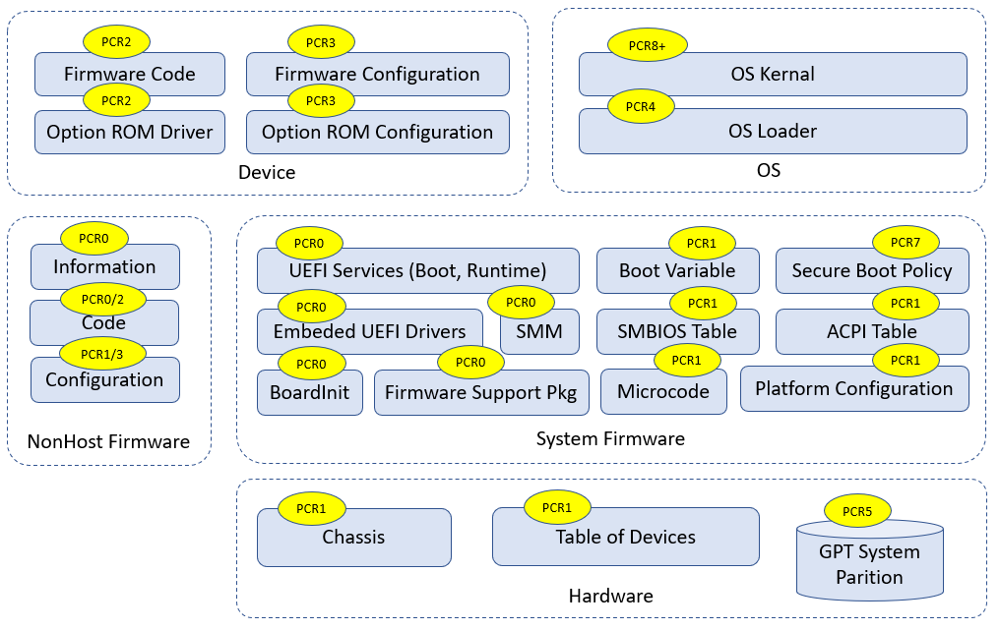
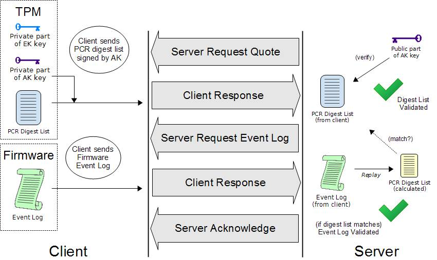
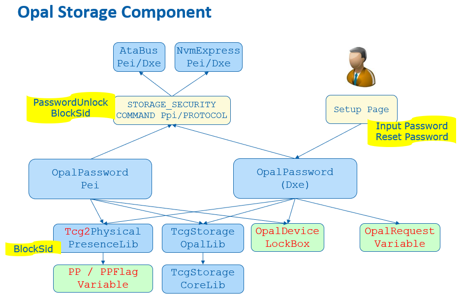
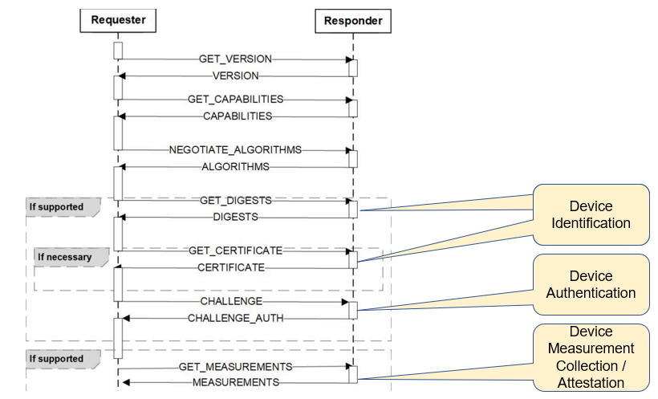
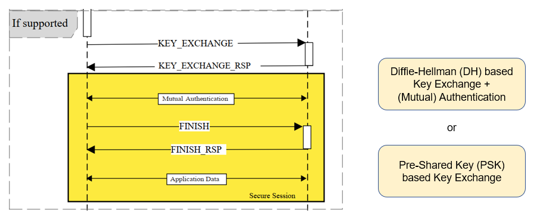
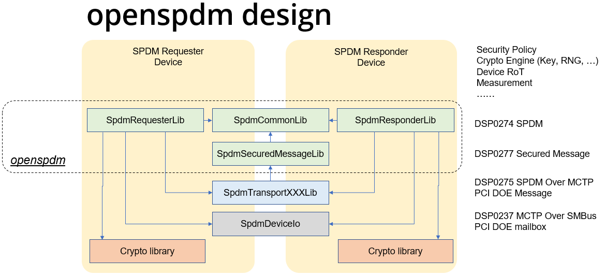
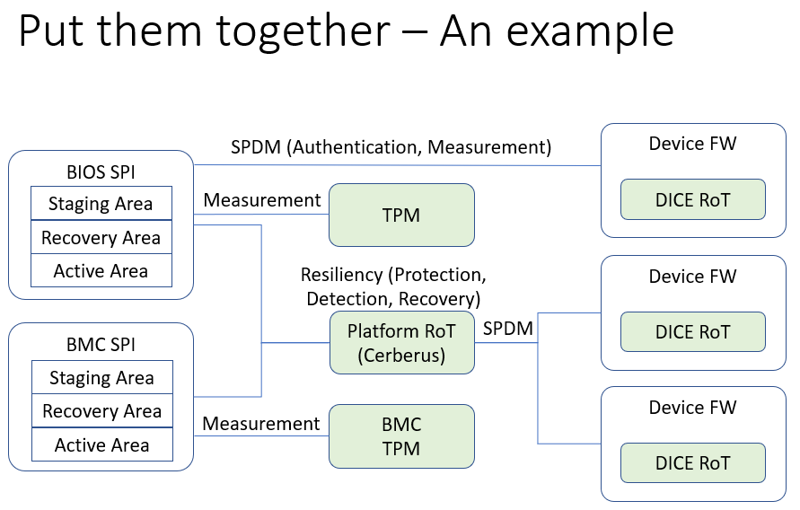

<!--- @file
  Understanding the Trusted Boot Chain Implementation

  Copyright (c) 2020, Intel Corporation. All rights reserved. 

  Redistribution and use in source (original document form) and 'compiled'
  forms (converted to PDF, epub, HTML and other formats) with or without
  modification, are permitted provided that the following conditions are met:

  1) Redistributions of source code (original document form) must retain the
     above copyright notice, this list of conditions and the following
     disclaimer as the first lines of this file unmodified.

  2) Redistributions in compiled form (transformed to other DTDs, converted to
     PDF, epub, HTML and other formats) must reproduce the above copyright
     notice, this list of conditions and the following disclaimer in the
     documentation and/or other materials provided with the distribution.

  THIS DOCUMENTATION IS PROVIDED BY TIANOCORE PROJECT "AS IS" AND ANY EXPRESS OR
  IMPLIED WARRANTIES, INCLUDING, BUT NOT LIMITED TO, THE IMPLIED WARRANTIES OF
  MERCHANTABILITY AND FITNESS FOR A PARTICULAR PURPOSE ARE DISCLAIMED. IN NO
  EVENT SHALL TIANOCORE PROJECT  BE LIABLE FOR ANY DIRECT, INDIRECT, INCIDENTAL,
  SPECIAL, EXEMPLARY, OR CONSEQUENTIAL DAMAGES (INCLUDING, BUT NOT LIMITED TO,
  PROCUREMENT OF SUBSTITUTE GOODS OR SERVICES; LOSS OF USE, DATA, OR PROFITS;
  OR BUSINESS INTERRUPTION) HOWEVER CAUSED AND ON ANY THEORY OF LIABILITY,
  WHETHER IN CONTRACT, STRICT LIABILITY, OR TORT (INCLUDING NEGLIGENCE OR
  OTHERWISE) ARISING IN ANY WAY OUT OF THE USE OF THIS DOCUMENTATION, EVEN IF
  ADVISED OF THE POSSIBILITY OF SUCH DAMAGE.

-->

**Understanding the Trusted Boot Chain Implementation**

Jiewen Yao

Intel Corporation

Vincent J. Zimmer

Intel Corporation

**November 2020**

Executive Summary
=================

This document explains how to implement the Trusted Computing Group
(TCG) static trusted boot chain, using the TianoCore EDK II project.

**Prerequisite**

This document assumes that the audience has basic firmware development
experience using UEFI & EDK II, along with basic knowledge of the UEFI
boot flow, Trusted Platform Module (TPM) and cryptography.

Table of Contents {#table-of-contents .TOC-Heading}
=================

[Overview 6](#overview)

[TCG Trusted Boot Chain in EDK II 8](#tcg-trusted-boot-chain-in-edk-ii)

[Trusted Boot Flow 8](#trusted-boot-flow)

[PCR, Measurement, and Attestation 8](#pcr-measurement-and-attestation)

[General Guideline 8](#general-guideline)

[PCR 0 12](#pcr-0)

[PCR 1 15](#pcr-1)

[PCR 2 16](#pcr-2)

[PCR 3 16](#pcr-3)

[PCR 4 16](#pcr-4)

[PCR 5 17](#pcr-5)

[PCR 6 17](#pcr-6)

[PCR 7 17](#pcr-7)

[NO\_ACTION event 18](#no_action-event)

[Event Log 18](#event-log)

[Hardware Root of Trust 19](#hardware-root-of-trust)

[Trusted Boot Chain -- Putting it all together
19](#trusted-boot-chain-putting-it-all-together)

[Remote Attestation 20](#remote-attestation)

[TPM Device Startup 23](#tpm-device-startup)

[TPM Device Selection 24](#tpm-device-selection)

[TPM Device Interface 24](#tpm-device-interface)

[Error Handling 25](#error-handling)

[TCG Physical Presence 26](#tcg-physical-presence)

[TPM Bank Selection 27](#tpm-bank-selection)

[TPM Hierarchy Management 30](#tpm-hierarchy-management)

[TCG Memory Overwrite (MOR) 31](#tcg-memory-overwrite-mor)

[OS Interface 33](#os-interface)

[ACPI Table 33](#acpi-table)

[TCG2\_PROTOCOL 34](#tcg2_protocol)

[TCG Storage 35](#tcg-storage)

[OPAL Password 35](#opal-password)

[OPAL Features 37](#opal-features)

[BlockSid 38](#blocksid)

[TPer reset 39](#tper-reset)

[Other Trusted Boot chains 40](#other-trusted-boot-chains)

[coreboot 40](#coreboot)

[Grub2 41](#grub2)

[Linux Secure Boot Shim 41](#linux-secure-boot-shim)

[Windows BitLocker 42](#windows-bitlocker)

[Looking Forward 43](#looking-forward)

[Platform Root of Trust - Cerberus
43](#platform-root-of-trust---cerberus)

[Device Root of Trust - DICE 43](#device-root-of-trust---dice)

[Server Management Domain Firmware
45](#server-management-domain-firmware)

[Secure communication -- SPDM 46](#secure-communication-spdm)

[An Open Trusted Platform -- Putting it all together
47](#an-open-trusted-platform-putting-it-all-together)

[Checklist for the Platform Developer
49](#checklist-for-the-platform-developer)

[PCR, Measurement and Attestation
49](#pcr-measurement-and-attestation-1)

[General Guideline 49](#general-guideline-1)

[PCR 0 49](#pcr-0-1)

[PCR 1 49](#pcr-1-1)

[PCR 2 50](#pcr-2-1)

[PCR 3 50](#pcr-3-1)

[PCR 4 50](#pcr-4-1)

[PCR 5 50](#pcr-5-1)

[PCR 6 50](#pcr-6-1)

[PCR 7 50](#pcr-7-1)

[NO\_ACTION event 51](#no_action-event-1)

[TPM Device Startup 51](#tpm-device-startup-1)

[Device Selection 51](#device-selection)

[TPM Device Interface 51](#tpm-device-interface-1)

[Error Handling 51](#error-handling-1)

[TCG Physical Presence 51](#tcg-physical-presence-1)

[TPM Bank Selection 51](#tpm-bank-selection-1)

[TPM Hierarchy Management 52](#tpm-hierarchy-management-1)

[TCG Memory Override 52](#tcg-memory-override)

[OS Interface 52](#os-interface-1)

[ACPI Table 52](#acpi-table-1)

[TCG2\_PROTOCOL 52](#tcg2_protocol-1)

[TCG Storage 53](#tcg-storage-1)

[OPAL Password 53](#opal-password-1)

[OPAL Feature 53](#opal-feature)

[BlockSid 53](#blocksid-1)

[TPer reset 53](#tper-reset-1)

[Glossary 54](#glossary)

[References 56](#references)

[Books 56](#books)

[Specifications 56](#specifications)

[Internet Links 58](#internet-links)

Overview
========

System firmware (BIOS/UEFI) plays an important role in computer platform
security. If the system firmware or configuration is altered from the
intended state, the system may experience loss of confidentiality,
integrity, and availability, including system instability, system
failure, and information leakage. Detecting a firmware code or
configuration change is of great importance, and can be accomplished by
measuring and monitoring firmware integrity.

In 2011, the National Institute of Standards and Technology
([NIST](https://www.nist.gov/)) published a draft version BIOS Integrity
Measurement Guidelines
([SP800-155](https://csrc.nist.gov/publications/detail/sp/800-155/draft)).
More recently, the Trusted Computing Group
([TCG](https://trustedcomputinggroup.org/)) has developed the following
documents to discuss firmware integrity measurement:

-   TCG Reference Integrity Manifest Information Model
    ([RIM-IM](https://trustedcomputinggroup.org/resource/tcg-reference-integrity-manifest-rim-information-model/))

-   TCG PC Client Reference Integrity Manifest
    ([PC-RIM](https://trustedcomputinggroup.org/resource/tcg-pc-client-reference-integrity-manifest-specification/))

-   PC Client Platform Firmware Profile
    ([PFP](https://trustedcomputinggroup.org/resource/pc-client-specific-platform-firmware-profile-specification/))

-   PC Client Platform Firmware Integrity Measurement
    ([FIM](https://trustedcomputinggroup.org/wp-content/uploads/TCG_PC_Client_FIM_v1_r40_02dec2020.pdf)) -
    Draft

The relationship between the above documents is as follows:

-   The NIST SP800-155 specification provides a general guideline on
    requirements. It does not describe implementation details.

-   The TCG RIM-IM specification defines the Reference Integrity
    Manifest (RIM) structure that a Verifier uses to validate expected
    values (Assertions) against actual values (Evidence).

-   The TCG PC Client RIM specification complements the TCG RIM-IM
    specification and describes the RIM file formats, RIM storage
    locations within the PC Client, and provides references for the
    content of the RIM support files.

-   The TCG PFP defines the implementation for a PC client firmware
    architecture. It defines how the platform firmware measures the
    firmware components into Trusted Platform Module (TPM) Platform
    Configuration Register (PCR) and how the firmware records the
    actions in an event log.

-   The TCG FIM draft specification provides a framework for determining
    the configuration of the hardware and the identity of the firmware
    which has executed to initialize the endpoint into a booted state. A
    FIM compliant platform shall implement the TCG PFP specification in
    order to provide runtime evidence and the platform shall also
    provide assertions based upon the TCG RIM specification.

In this document, we will focus on the TCG Platform Firmware Profile
specification. The PFP specification defines how a platform firmware
contributes to the Root of Trust for Measurement (RTM) of the platform
through extending digests (measurements) of code into a TPM Platform
Configuration Register (PCR). The PFP specification also provides the
documentation of that measurement in an event log.

Figure 1 below shows a simple example of the firmware validation
process. An Original Equipment Manufacturer (OEM) provides a RIM as the
assertion to describe the system platform. When a corresponding system
boots, the platform firmware measures the component into some TPM PCR's
and generates an event log as evidence. The whole platform acts as an
attester and presents the event log and PCR's as evidence to a verifier.
Then the verifier can compare the evidence (event log and PCRs) and
compare it with the assertion (RIM manifest).

> {width="6.5in"
> height="4.319444444444445in"}

*Figure 1. Measurement and Attestation*

> A verifier can use various policies to determine the state of the
> platform. Some example policies include the following:

-   All event log match - It means the platform is expected to meet all
    of the expected values.

-   Event log on code (PCR0) and security policy (PCR7) match but the
    configuration data (PCR1) has a mismatch -- It means someone changed
    the BIOS setup configuration.

-   Event log on security policy (PCR7) match but code (PCR0) mismatches
    -- It means someone has updated the platform firmware code.

-   All event log mismatch -- It means the platform is not in the
    expected code or configuration state.

TCG Trusted Boot Chain in EDK II
================================

Trusted Boot Flow
-----------------

Trusted boot flow is activity that the host platform firmware measures,
including firmware components, into the Trusted Platform Module (TPM)
Platform Configuration Register (PCR), and records the actions in an
event log. The TPM acts as a static Root of Trust for Storage (RTS) and
Root of Trust for Reporting (RTR). The platform firmware here acts as a
Static Root of Trust for Measurement (SRTM).

In this document, we use TPM 2.0 as an example. Unless otherwise
specified, the term TPM below refers to a TPM 2.0 device.

PCR, Measurement, and Attestation
---------------------------------

The TPM PCRs hold the values of the data measurement. The measurement
follows the equation below. This operation is PCR extend.

*PCR ~(new)~ = HASH (PCR~(old)~ \|\| HASH(Data))*

PCR extend is the only way to modify the PCR value. If a platform
extends a PCR multiple times, all data is hashed into the PCR. The
vertical bars in parentheses designate the catenation of the old and new
data, respectively.

### General Guideline

A typical TPM has 24 PCRs. PCRs \[0-15\] represent the SRTM and are
associated with Locality 0. PCRs \[0-7\] are used for platform firmware
and PCRs \[8-15\] are used for the operating system. PCR \[16\] is for
debug usage. PCR \[23\] is for application support. PCRs \[17-22\]
represent the platform's dynamic root of trust for measurement (DRTM).
In this document we will focus on the usage of PCRs \[0-7\], as
described in the following table.

Table 1: TPM PCR Usage (Source: [TCG PFP
Specification](https://trustedcomputinggroup.org/resource/pc-client-specific-platform-firmware-profile-specification/))

  **PCR Index**   **PCR Usage**
  --------------- -----------------------------------------------------------------------------------------------------
  0               SRTM, BIOS, Host Platform Extensions, Embedded Option ROMs and PI Drivers
  1               Host Platform Configuration
  2               UEFI driver and application Code
  3               UEFI driver and application Configuration and Data
  4               UEFI Boot Manager Code (usually the MBR) and Boot Attempts
  5               Boot Manager Code Configuration and Data (for use by the Boot Manager Code) and GPT/Partition Table
  6               Host Platform Manufacturer Specific
  7               Secure Boot Policy, Secure boot Verification Authority

The following figure shows the high-level components and measurements.

{width="6.492361111111111in"
height="4.098611111111111in"}

*Figure 2 -- High-level components and measurements\
(See Building Secure Firmware by Jiewen Yao & Vincent Zimmer)*

There is an easy way to remember Table 1, as described by the following
two rules:

1)  Even-numbered PCRs are for the code, while odd-numbered PCRs are for
    configuration data.

2)  PCRs \[0-1\] are for the OEM, PCRs \[2-3\] are for third party
    usage, PCRs \[4-5\] are for OS boot, PCR\[7\] is for secure boot
    policy, PCR\[6\] is undefined by the PFP spec and is
    platform-specific.

Table 2. PCR usage (simple rules)

                       Code       Data Configuration
  -------------------- ---------- --------------------
  OEM                  PCR\[0\]   PCR\[1\]
  Third party          PCR\[2\]   PCR\[3\]
  OS Boot              PCR\[4\]   PCR\[5\]
  Secure Boot Policy   N/A        PCR\[7\]

For example:

-   Any **PEI, DXE, and SMM code in flash FV** are OEM code. They go
    into PCR\[0\].

-   **ACPI data** from OEM code is important for boot. It goes into
    PCR\[0\].

-   An **integrated PCI card option ROM** in flash FV is provided by the
    OEM. It goes to PCR\[0\]. An **external PCI card Option ROM** is
    third party code. It goes into PCR\[2\].

-   If **a non-host component** or **a device firmware can only be
    updated by OEM** platform code, it goes into PCR\[0\]. If **a
    non-host component** or **a device firmware can be updated by an
    entity other than the OEM** platform code, it goes into PCR\[2\].

-   A **CPU Microcode update** can be treated as code or data. It can go
    into PCR\[0\] or PCR\[1\].

-   **SMBIOS tables** are OEM configuration data. They go into PCR\[1\].

-   **Setup variable** and **policy configuration** are OEM
    configuration data. They go into PCR\[1\].

-   **UEFI Boot\#\#\#\#** and **BootOrder variable** are OEM
    configuration data. They go into PCR\[1\].

-   If **a non-host component** or **a device firmware configuration can
    only be updated by OEM** platform code, it goes into PCR\[1\]. If
    **a non-host component** or **a device firmware configuration can be
    updated by an entity other than OEM** platform code, it goes into
    PCR\[3\].

-   If the action is to **enter an OEM provided setup utility**, it goes
    into PCR\[1\]. If the action is to **enter a third party provided
    setup utility**, it goes into PCR\[3\].

-   **OS Loader** is OS boot related code. It goes into PCR\[4\].

-   **Boot Attempt action** goes into PCR\[4\]. The **ExitBootService
    action** goes into PCR\[5\].

-   **Disk geometry, such as a GUID partition table (GPT)**, is OS boot
    related configuration. It goes into PCR\[5\].

-   **UEFI Secure Boot variables**, such as the Platform Key (PK), Key
    Exchange Key (KEK), image signature database (db), and image
    forbidden signature database (dbx) are all related to secure boot
    policy. They go into PCR\[7\].

-   If **the security configuration policy** is boot security sensitive,
    it goes into PCR\[7\]. If it is NOT boot security sensitive, it goes
    into PCR\[1\].

-   **Secure feature disabling, such as DMA protection disabling,** is
    security sensitive. It goes into PCR\[7\].

-   **Debug mode information** is security sensitive. It goes into
    PCR\[7\].

Some other rules for the data that shall not be measured into PCR are as
follows:

1)  PCRs can only record statically configured, unchangeable data. A
    **PCR cannot record data that are dynamic and changeable across the
    boot**, such as system clock, fan speed, boot count, system reset
    reason, battery power, a nonce value, a pointer, etc.

For example:

-   The firmware must measure the PE COFF image before the relocation
    into different memory location.

-   The firmware must measure the ACPI table from flash prior to any
    modification. An ACPI table patch may apply different data settings
    based upon policy, such as ACPI version selection for a secondary
    system description table (SSDT), or different addresses, such as a
    non-volatile storage memory location for a differentiated system
    description table (DSDT).

-   The firmware must measure partial portions of the SMBIOS table
    because some SMBIOS tables may contain some automatically updated
    information, such as WakeupType, Voltage, ResetCount, or
    NominalSpeed.

2)  A PCR can only record the class of information. A **PCR cannot
    record the instance of specific information that may be used to
    unique identify a system**, such as an asset tag, a serial number,
    etc.

For example:

-   The firmware must measure partial portions of the SMBIOS tables
    because some SMBIOS table entries may contain the instance specific
    unique information, such as SerialNumber, UUID, AssetTag,
    PartNumber.

3)  **A PCR cannot record any privacy sensitive information**.

All of the above PCR measurements need to be recorded into an event log
which can be used to reproduce the PCR value. Besides that, the event
log may include some NO\_ACTION event types. This type means that the
data are not required to be measured into PCR. The event log entry is
intended to provide additional information to the event log consumer.
For example:

-   **Specification ID event** -- It is to provide information to the
    consumer regarding which version of specification is implemented.

-   **Reference Manifest event** -- It is to provide NIST SP800-155
    reference integrity manifest information, such as platform
    manufacturer ID, reference manifest GUID, etc.

-   **Startup Locality event** -- It is to record the locality from
    which the TPM2\_Startup command was sent in cases where the Locality
    sending the TPM2\_Startup command is Locality 3.

Most TCG TPM related code in EDK II is located at
[SecurityPkg](https://github.com/tianocore/edk2/tree/master/SecurityPkg).
The
[Tcg2Pei](https://github.com/tianocore/edk2/tree/master/SecurityPkg/Tcg/Tcg2Pei)
module handles the PEI phase measurement. The
[Tcg2Dxe](https://github.com/tianocore/edk2/tree/master/SecurityPkg/Tcg/Tcg2Dxe)
DXE driver handles the DXE phase measurement. The
[DxeTpm2MeasureBootLib](https://github.com/tianocore/edk2/tree/master/SecurityPkg/Library/DxeTpm2MeasureBootLib)
library handles the PE image measurements and GPT measurement. All event
type definition can be found at
[UefiTcgPlatform.h](https://github.com/tianocore/edk2/blob/master/MdePkg/Include/IndustryStandard/UefiTcgPlatform.h).
Figure 3 below shows the high level flow of the modules.

{width="6.5in"
height="3.4166666666666665in"}

Figure 3: TCG Trusted Boot Flow

### PCR 0

The SRTM's version identifier is measured by the
[Tcg2Pei.c](https://github.com/tianocore/edk2/blob/master/SecurityPkg/Tcg/Tcg2Pei/Tcg2Pei.c)
**MeasureCRTMVersion**() function. The event type is
[EV\_S\_CRTM\_VERSION](https://github.com/tianocore/edk2/blob/master/MdePkg/Include/IndustryStandard/UefiTcgPlatform.h).
EDKII uses
[PcdFirmwareVersionString](https://github.com/tianocore/edk2/blob/master/MdeModulePkg/MdeModulePkg.dec)
to let a platform pass the SRTM version information. The version string
is encoded as a Unicode string with a NULL terminator.

The platform firmware is measured by the
[Tcg2Pei.c](https://github.com/tianocore/edk2/blob/master/SecurityPkg/Tcg/Tcg2Pei/Tcg2Pei.c)
**MeasureFvImage()** function with firmware volume (FV) granularity. The
event type is
[EV\_EFI\_PLATFORM\_FIRMWARE\_BLOB](https://github.com/tianocore/edk2/blob/master/MdePkg/Include/IndustryStandard/UefiTcgPlatform.h)
or
[EV\_EFI\_PLATFORM\_FIRMWARE\_BLOB2](https://github.com/tianocore/edk2/blob/master/MdePkg/Include/IndustryStandard/UefiTcgPlatform.h),
based upon the
[PcdTcgPfpMeasurementRevision](https://github.com/tianocore/edk2/blob/master/MdeModulePkg/MdeModulePkg.dec).
The
[Tcg2Pei.c](https://github.com/tianocore/edk2/blob/master/SecurityPkg/Tcg/Tcg2Pei/Tcg2Pei.c)
module measures the main BIOS at **MeasureMainBios**() and then installs
a callback function **FirmwareVolumeInfoPpiNotifyCallback**() at the
memory present entrypoint **PeimEntryMP**(). Whenever a new FV is
installed, this callback is invoked and the new FV is measured.

To avoid duplicated measurements, the
**FirmwareVolumeInfoPpiNotifyCallback**() will carefully check the new
installed FV to ensure that the same FV will not be measured twice. It
will also ensure that the child FV will not be measured.

The
[EFI\_PEI\_FIRMWARE\_VOLUME\_INFO\_MEASUREMENT\_EXCLUDED\_PPI](https://github.com/tianocore/edk2/blob/master/SecurityPkg/Include/Ppi/FirmwareVolumeInfoMeasurementExcluded.h)
interface is designed to let a platform report to the
[Tcg2Pei](https://github.com/tianocore/edk2/tree/master/SecurityPkg/Tcg/Tcg2Pei)
module that the installed FV is already measured. There is no need to
measure it again. This is usually done by a hardware based static root
of trust for measurement, such as Intel Authenticated Code Module (ACM)
in Intel Boot Guard technology. If the ACM has already measured the
initial FV, such as PEI FV into the TPM PCR, then a BootGuard platform
module can report this information. The
[Tcg2Pei.c](https://github.com/tianocore/edk2/blob/master/SecurityPkg/Tcg/Tcg2Pei/Tcg2Pei.c)
**MeasureFvImage**() service will check this PPI in order to skip the
measurement and event log report.

The
[EDKII\_PEI\_FIRMWARE\_VOLUME\_INFO\_PREHASHED\_FV\_PPI](https://github.com/tianocore/edk2/blob/master/SecurityPkg/Include/Ppi/FirmwareVolumeInfoPrehashedFV.h)
service is designed to let a platform report the hash of an FV to the
[Tcg2Pei](https://github.com/tianocore/edk2/tree/master/SecurityPkg/Tcg/Tcg2Pei).
This is also done by a hardware based root of trust module without
measuring the FV. The ACM in Intel Boot Guard may just use this hash to
verify the initial FV, such as PEI FV, but not measure the FV according
to the policy. Then a BootGuard platform module can report this
information. Because the hash value is stored in the Boot Guard boot
policy manifest (BPM) and it is also verified by the ACM, the hash can
be trusted.
[Tcg2Pei.c](https://github.com/tianocore/edk2/blob/master/SecurityPkg/Tcg/Tcg2Pei/Tcg2Pei.c)
**MeasureFvImage**() will check this PPI to skip the hash calculation
and directly measure the hash into PCR and also record the event log.

[EDKII\_PEI\_FIRMWARE\_VOLUME\_INFO\_STORED\_HASH\_FV\_PPI](https://github.com/tianocore/edk2/blob/master/SecurityPkg/Include/Ppi/FirmwareVolumeInfoStoredHashFv.h)
is also designed to let a platform report the hash of an FV, but with a
different purpose. The hash is reported to
[FvReportPei](https://github.com/tianocore/edk2/tree/master/SecurityPkg/FvReportPei)
for FV verification, but not to the TcgPei for FV measurement. The
intent is to let
[FvReportPei.c](https://github.com/tianocore/edk2/blob/master/SecurityPkg/FvReportPei/FvReportPei.c)
**CheckStoredHashFv()** verify the FV based upon the hash. The hash
value is provisioned by the OEM in the Boot Guard BPM. The ACM will NOT
verify the hash value against the corresponding FV, such as the DXE FV.
Since the hash value storage is signed and verified by the ACM it can be
trusted. Then the
[FvReportPei.c](https://github.com/tianocore/edk2/blob/master/SecurityPkg/FvReportPei/FvReportPei.c)
**VerifyHashedFv()** can verify the DXE FV based upon the hash
information. Once **VerifyHashedFv()** passes the verification, it can
install
[EDKII\_PEI\_FIRMWARE\_VOLUME\_INFO\_PREHASHED\_FV\_PPI](https://github.com/tianocore/edk2/blob/master/SecurityPkg/Include/Ppi/FirmwareVolumeInfoPrehashedFV.h)
to Tcg2Pei.

[Tcg2Pei](https://github.com/tianocore/edk2/tree/master/SecurityPkg/Tcg/Tcg2Pei)
is not the only module that measures data in the PEI phase. It also
produces
[EDKII\_TCG\_PPI](https://github.com/tianocore/edk2/blob/master/SecurityPkg/Include/Ppi/Tcg.h)
**HashLogExtendEvent**() API. As such, other module can also measure the
data in the PEI phase by calling
[TpmMeasurementLib](https://github.com/tianocore/edk2/blob/master/MdeModulePkg/Include/Library/TpmMeasurementLib.h)
**TpmMeasureAndLogData**(). The PEI instance
[PeiTpmMeasurementLib](https://github.com/tianocore/edk2/tree/master/SecurityPkg/Library/PeiTpmMeasurementLib)
uses the
[EDKII\_TCG\_PPI](https://github.com/tianocore/edk2/blob/master/SecurityPkg/Include/Ppi/Tcg.h).
Moreover, the
[TcgEventLogRecordLib](https://github.com/tianocore/edk2/blob/master/SecurityPkg/Include/Library/TcgEventLogRecordLib.h)
provides more services, such as **MeasureFirmwareBlob**() and
**MeasureHandoffTable**(). The
[TcgEventLogRecordLib.c](https://github.com/tianocore/edk2/blob/master/SecurityPkg/Library/TcgEventLogRecordLib/TcgEventLogRecordLib.c)
can choose
[EV\_EFI\_PLATFORM\_FIRMWARE\_BLOB](https://github.com/tianocore/edk2/blob/master/MdePkg/Include/IndustryStandard/UefiTcgPlatform.h)
or
[EV\_EFI\_PLATFORM\_FIRMWARE\_BLOB2](https://github.com/tianocore/edk2/blob/master/MdePkg/Include/IndustryStandard/UefiTcgPlatform.h),
and
[EV\_EFI\_HANDOFF\_TABLES](https://github.com/tianocore/edk2/blob/master/MdePkg/Include/IndustryStandard/UefiTcgPlatform.h)
or
[EV\_EFI\_HANDOFF\_TABLES2](https://github.com/tianocore/edk2/blob/master/MdePkg/Include/IndustryStandard/UefiTcgPlatform.h)
based upon
[PcdTcgPfpMeasurementRevision](https://github.com/tianocore/edk2/blob/master/MdeModulePkg/MdeModulePkg.dec).

Some platform firmware uses the Intel Firmware Supported Package (FSP)
binary to initialize the silicon. The FSP contains the firmware code. As
such, the FSP binary shall also be measured. The FSP-T and FSP-M are
measured by
[FspmWrapperPeim](https://github.com/tianocore/edk2/tree/master/IntelFsp2WrapperPkg/FspmWrapperPeim).
The FSP-S is measured by
[FspsWrapperPeim](https://github.com/tianocore/edk2/tree/master/IntelFsp2WrapperPkg/FspsWrapperPeim).
They call
[FspMeasurementLib](https://github.com/tianocore/edk2/blob/master/IntelFsp2WrapperPkg/Include/Library/FspMeasurementLib.h)
**MeasureFspFirmwareBlob**() and this function calls
[TcgEventLogRecordLib](https://github.com/tianocore/edk2/blob/master/SecurityPkg/Include/Library/TcgEventLogRecordLib.h)
**MeasureFirmwareBlob ()**. One special thing about FSP measurement is
that the FSP binary includes not only code but also configuration. A
platform may want to measure the FSP code to PCR0 and FSP static
configuration to PCR1. In order to support that,
[FspMeasurementLib.c](https://github.com/tianocore/edk2/blob/master/IntelFsp2WrapperPkg/Library/BaseFspMeasurementLib/FspMeasurementLib.c)
**MeasureFspFirmwareBlob**() refers the **PcdFspMeasurementConfig** to
determine if it needs separate measurements by using
**MeasureFspFirmwareBlobWithCfg**().

All measured firmware volumes are recorded in
[EFI\_MEASURED\_FV\_HOB](https://github.com/tianocore/edk2/blob/master/SecurityPkg/Include/Guid/MeasuredFvHob.h)
by the Tcg2Pei.c **EndofPeiSignalNotifyCallBack**() service in order to
avoid duplicated measurements. If a firmware volume is NOT reported in
the PEI phase, then it needs to be measured in the DXE phase. Similar to
[Tcg2Pei](https://github.com/tianocore/edk2/tree/master/SecurityPkg/Tcg/Tcg2Pei),
the
[Tcg2Dxe](https://github.com/tianocore/edk2/tree/master/SecurityPkg/Tcg/Tcg2Dxe)
produces
[EFI\_TCG2\_PROTOCOL](https://github.com/tianocore/edk2/blob/master/MdePkg/Include/Protocol/Tcg2Protocol.h)
**HashLogExtendEvent**() API. The DXE instance
[DxeTpmMeasurementLib](https://github.com/tianocore/edk2/tree/master/SecurityPkg/Library/DxeTpmMeasurementLib)
uses the
[EFI\_TCG2\_PROTOCOL](https://github.com/tianocore/edk2/blob/master/MdePkg/Include/Protocol/Tcg2Protocol.h)
to let other modules measure more firmware data.

EDK II assumes that all OEM firmware volumes are reported in the PEI
phase. As such, the firmware volume dispatched in the DXE phase is not
measured at FV granularity, but instead the code is measured at PE image
granularity in
[DxeTpm2MeasureBootLib](https://github.com/tianocore/edk2/tree/master/SecurityPkg/Library/DxeTpm2MeasureBootLib).
[DxeTpm2MeasureBootLib](https://github.com/tianocore/edk2/tree/master/SecurityPkg/Library/DxeTpm2MeasureBootLib)
is a hook to the
[EFI\_SECURITY2\_ARCH\_PROTOCOL](https://github.com/tianocore/edk2/blob/master/MdePkg/Include/Protocol/Security2.h).
It is linked with
[SecurityStubDxe](https://github.com/tianocore/edk2/tree/master/MdeModulePkg/Universal/SecurityStubDxe)
and
[DxeSecurityManagementLib](https://github.com/tianocore/edk2/tree/master/MdeModulePkg/Library/DxeSecurityManagementLib).
When the DxeCore dispatches an EFI image, it calls
[EFI\_SECURITY2\_ARCH\_PROTOCOL](https://github.com/tianocore/edk2/blob/master/MdePkg/Include/Protocol/Security2.h)
**FileAuthentication**(). Then **DxeTpm2MeasureBootHandler**() will be
invoked finally. The general rule is that:

1\) If a PE image driver or application is from an unmeasured FV, then
the PE image will be measured. A PE image driver will be measured into
PCR2 and a PE image application will be measured into PCR4.

2\) If a PE image driver is from a measured FV, it will NOT be measured.

3\) If a PE image application is from a measured FV, it will still be
measured to PCR4.

This logic is in
[DxeTpm2MeasureBootLib.c](https://github.com/tianocore/edk2/blob/master/SecurityPkg/Library/DxeTpm2MeasureBootLib/DxeTpm2MeasureBootLib.c)
**DxeTpm2MeasureBootHandler**(). We will discuss more about this process
in the PCR2 section and PCR4 section, respectively.

If there is an additional executable binary loaded, this executable
binary shall be measured. For example, the SMM Transfer Monitor (STM)
image is measured in
[SmmStm.c](https://github.com/tianocore/edk2/blob/master/UefiCpuPkg/Library/SmmCpuFeaturesLib/SmmStm.c)
**LoadMonitor**() with TXT\_EVTYPE\_STM\_HASH.

ACPI tables should be measured before any data patches are applied. For
example, the
[Tcg2Smm](https://github.com/tianocore/edk2/tree/master/SecurityPkg/Tcg/Tcg2Smm)
measures the [TPM2
ACPI](https://github.com/tianocore/edk2/blob/master/MdePkg/Include/IndustryStandard/Tpm2Acpi.h)
table in **PublishTpm2**() and [TPM
SSDT](https://github.com/tianocore/edk2/blob/master/SecurityPkg/Tcg/Tcg2Smm/Tpm.asl)
ACPI table in **PublishAcpiTable**(), before any data patches, such as
[PcdTpm2AcpiTableRev](https://github.com/tianocore/edk2/blob/master/SecurityPkg/SecurityPkg.dec),
[PcdTpm2AcpiTableLaml](https://github.com/tianocore/edk2/blob/master/SecurityPkg/SecurityPkg.dec),
[PcdTpm2AcpiTableLasa](https://github.com/tianocore/edk2/blob/master/SecurityPkg/SecurityPkg.dec),
[PcdActiveTpmInterfaceType](https://github.com/tianocore/edk2/blob/master/SecurityPkg/SecurityPkg.dec),
[PcdTcgPhysicalPresenceInterfaceVer](https://github.com/tianocore/edk2/blob/master/SecurityPkg/SecurityPkg.dec),
[PcdTpm2CurrentIrqNum](https://github.com/tianocore/edk2/blob/master/SecurityPkg/SecurityPkg.dec),
[PcdTpm2PossibleIrqNumBuf](https://github.com/tianocore/edk2/blob/master/SecurityPkg/SecurityPkg.dec),
etc.

A platform may include a non-host environment, such as the Intel
Management Engine (ME). The non-host information shall be measured with
[EV\_NONHOST\_INFO](https://github.com/tianocore/edk2/blob/master/MdePkg/Include/IndustryStandard/UefiTcgPlatform.h)
by a platform specific module. If the non-host platform can only be
updated by Platform Firmware, then the non-host code shall be measured
with
[EV\_NONHOST\_CODE](https://github.com/tianocore/edk2/blob/master/MdePkg/Include/IndustryStandard/UefiTcgPlatform.h)
by a platform specific module.

A platform may report the SRTM contents with
[EV\_S\_CRTM\_CONTENTS](https://github.com/tianocore/edk2/blob/master/MdePkg/Include/IndustryStandard/UefiTcgPlatform.h).
For example, an Intel BootGuard enabled platform may report
[EV\_S\_CRTM\_CONTENTS](https://github.com/tianocore/edk2/blob/master/MdePkg/Include/IndustryStandard/UefiTcgPlatform.h)
with the BootGuard ACM, Key Manifest (KM) and Boot Policy Manifest (BPM)
information.

EV\_SEPARATOR is used to draw a line between the pre-boot environment
and entering a post-boot environment.
[Tcg2Dxe.c](https://github.com/tianocore/edk2/blob/master/SecurityPkg/Tcg/Tcg2Dxe/Tcg2Dxe.c)
will use **MeasureSeparatorEvent**() to record
[EV\_SEPARATOR](https://github.com/tianocore/edk2/blob/master/MdePkg/Include/IndustryStandard/UefiTcgPlatform.h)
with 0x00000000 for PCR0\~6 in the **OnReadyToBoot**() function upon the
first boot attempt. EV\_SEPARATOR for PCR7 is handled earlier in
**MeasureSecureBootPolicy**(). We will discuss this later in the PCR7
section.

If a system starts up with an error status, then an error
[EV\_SEPARATOR](https://github.com/tianocore/edk2/blob/master/MdePkg/Include/IndustryStandard/UefiTcgPlatform.h)
shall be measured.
[Tcg2Pei.c](https://github.com/tianocore/edk2/blob/master/SecurityPkg/Tcg/Tcg2Pei/Tcg2Pei.c)
**PeimEntryMA**() detects the error and uses
**MeasureSeparatorEventWithError**() to record
[EV\_SEPARATOR](https://github.com/tianocore/edk2/blob/master/MdePkg/Include/IndustryStandard/UefiTcgPlatform.h)
with 0x00000001 for PCR0\~7. More details of TPM error handling will be
discussed later.

### PCR 1

A platform usually includes multiple CPU Microcode update files and put
them all together into a microcode FV. At runtime, the CPU module will
scan them one by one and only load the one matching the current CPU. A
platform may choose to measure the whole Microcode FV or the
individually-used Microcode, such as the one from
[EDKII\_MICROCODE\_PATCH\_HOB](https://github.com/tianocore/edk2/blob/master/UefiCpuPkg/Include/Guid/MicrocodePatchHob.h)
or
[PcdCpuMicrocodePatchAddress](https://github.com/tianocore/edk2/blob/master/UefiCpuPkg/UefiCpuPkg.dec).
The current EDK II does not provide an example in the CPU module. A
platform needs to perform such measurement based upon the platform
policy.

[SmbiosMeasurementDxe](https://github.com/tianocore/edk2/tree/master/MdeModulePkg/Universal/SmbiosMeasurementDxe)
is an example of SMBIOS table measurement. We call it an example because
the SMBIOS table measurement requires a platform specific policy to skip
the dynamic changeable information and instance-specific unique
information in the table or a field of the table. This
[SmbiosMeasurementDxe.c](https://github.com/tianocore/edk2/blob/master/MdeModulePkg/Universal/SmbiosMeasurementDxe/SmbiosMeasurementDxe.c)
**FilterSmbiosEntry**() will skip all OEM type SMBIOS tables and zero
the dynamic changeable information and instance specific unique
information before the measurement. The policy -
**mSmbiosFilterStandardTableBlackList** is hardcoded in the module. Once
the SMBIOS is filtered, the **MeasureSmbiosTable**() function will
choose the event type
[EV\_EFI\_HANDOFF\_TABLES](https://github.com/tianocore/edk2/blob/master/MdePkg/Include/IndustryStandard/UefiTcgPlatform.h)
or
[EV\_EFI\_HANDOFF\_TABLES2](https://github.com/tianocore/edk2/blob/master/MdePkg/Include/IndustryStandard/UefiTcgPlatform.h)
based upon the
[PcdTcgPfpMeasurementRevision](https://github.com/tianocore/edk2/blob/master/MdeModulePkg/MdeModulePkg.dec)
to measure the SMBIOS table. If a platform wants to use a different
policy, it may implement another SmbiosMeasurementDxe module and not use
this one.

The UEFI boot related variables, such as "Boot\#\#\#\#" and "BootOrder."
are measured by
[Tcg2Dxe.c](https://github.com/tianocore/edk2/blob/master/SecurityPkg/Tcg/Tcg2Dxe/Tcg2Dxe.c)
**ReadAndMeasureBootVariable**(). The event type is
[EV\_EFI\_VARIABLE\_BOOT](https://github.com/tianocore/edk2/blob/master/MdePkg/Include/IndustryStandard/UefiTcgPlatform.h).
These variables are measured if they are present in
**MeasureAllBootVariables**().

Other Setup variables or policy configurations are OEM specific data.
They should be measured in an OEM specific module.

For a server platform where
[PcdTpmPlatformClass](https://github.com/tianocore/edk2/blob/master/MdeModulePkg/MdeModulePkg.dec)
is TCG\_PLATFORM\_TYPE\_SERVER, the multi-processor information
([EFI\_CPU\_PHYSICAL\_LOCATION](https://github.com/tianocore/edk2/blob/master/MdePkg/Include/Protocol/MpService.h))
is measured by the module
[Tcg2Dxe.c](https://github.com/tianocore/edk2/blob/master/SecurityPkg/Tcg/Tcg2Dxe/Tcg2Dxe.c)
**MeasureHandoffTables**(). The event type is
[EV\_TABLE\_OF\_DEVICES](https://github.com/tianocore/edk2/blob/master/MdePkg/Include/IndustryStandard/UefiTcgPlatform.h).
Other devices are not handled in Tcg2Dxe but may be handled in an OEM
platform module.

If a platform has a setup utility which does not require an
unconditional reset, then the platform shall measure "Entering ROM Based
Setup" with
[EV\_ACTION](https://github.com/tianocore/edk2/blob/master/MdePkg/Include/IndustryStandard/UefiTcgPlatform.h).
This can be done in the platform utility.

A platform may include a non-host environment, such as the Intel
Management Engine (ME). If the non-host platform can only be updated by
the Platform Firmware, then the non-host configuration should be
measured with
[EV\_NONHOST\_CONFIG](https://github.com/tianocore/edk2/blob/master/MdePkg/Include/IndustryStandard/UefiTcgPlatform.h)
by a platform specific module.

### PCR 2

A third party UEFI driver, such as a PCI EFI option ROM, is measured by
[DxeTpm2MeasureBootLib.c](https://github.com/tianocore/edk2/blob/master/SecurityPkg/Library/DxeTpm2MeasureBootLib/DxeTpm2MeasureBootLib.c)
**Tcg2MeasurePeImage**() in **DxeTpm2MeasureBootHandler**(). The event
type for a UEFI boot services driver is
[EV\_EFI\_BOOT\_SERVICES\_DRIVER](https://github.com/tianocore/edk2/blob/master/MdePkg/Include/IndustryStandard/UefiTcgPlatform.h)
and the event type for a UEFI runtime services driver is
[EV\_EFI\_RUNTIME\_SERVICES\_DRIVER](https://github.com/tianocore/edk2/blob/master/MdePkg/Include/IndustryStandard/UefiTcgPlatform.h).
If a UEFI driver resides in an unmeasured FV which is dispatched in the
DXE phase, it is also measured with the same policy into PCR2.

A platform may include a non-host environment, such as Intel Management
Engine (ME). If the non-host platform can be updated by entities other
than the Platform Firmware, then the non-host code shall be measured
with
[EV\_NONHOST\_CODE](https://github.com/tianocore/edk2/blob/master/MdePkg/Include/IndustryStandard/UefiTcgPlatform.h)
by a platform specific module.

A platform may include Secure Protocol and Data Model
([SPDM](https://www.dmtf.org/sites/default/files/standards/documents/DSP0274_1.1.0.pdf))
capable devices. The platform should use the GET\_MEASUREMENT command to
retrieve the device firmware measurement and measure the immutable ROM
and mutable firmware with
[EV\_EFI\_SPDM\_FIRMWARE\_BLOB](https://github.com/tianocore/edk2/blob/master/MdePkg/Include/IndustryStandard/UefiTcgPlatform.h)
in
[TCG\_DEVICE\_SECURITY\_EVENT\_DATA](https://github.com/tianocore/edk2/blob/master/MdePkg/Include/IndustryStandard/UefiTcgPlatform.h).
A prototype can be found at
[DeviceSecurityPkg](https://github.com/jyao1/edk2/tree/DeviceSecurity/DeviceSecurityPkg)
[SpdmDeviceMeasurement.c](https://github.com/jyao1/edk2/blob/DeviceSecurity/DeviceSecurityPkg/SpdmDeviceSecurityDxe/SpdmDeviceMeasurement.c).
For SPDM, we will discuss the topic in the last chapter.

### PCR 3

If the option ROM or UEFI application has a setup utility which does not
require an unconditional reset, then the platform shall measure
"Entering ROM Based Setup" with
[EV\_ACTION](https://github.com/tianocore/edk2/blob/master/MdePkg/Include/IndustryStandard/UefiTcgPlatform.h).
This can be done in the utility.

A platform may include a non-host environment, such as the Intel
Management Engine (ME). If the non-host platform can be updated by
entities other than Platform Firmware, then the non-host configuration
should be measured with
[EV\_NONHOST\_CONFIG](https://github.com/tianocore/edk2/blob/master/MdePkg/Include/IndustryStandard/UefiTcgPlatform.h)
by a platform specific module.

A platform may include SPDM capable devices. The platform should use the
GET\_MEASUREMENT command to retrieve the device firmware measurement and
measure the hardware configuration and firmware configuration with
[EV\_EFI\_SPDM\_FIRMWARE\_CONFIG](https://github.com/tianocore/edk2/blob/master/MdePkg/Include/IndustryStandard/UefiTcgPlatform.h)
in
[TCG\_DEVICE\_SECURITY\_EVENT\_DATA](https://github.com/tianocore/edk2/blob/master/MdePkg/Include/IndustryStandard/UefiTcgPlatform.h).

### PCR 4

A third party UEFI application, such as a UEFI shell utility, a standard
OS loader or an OEM boot option, is measured by
[DxeTpm2MeasureBootLib.c](https://github.com/tianocore/edk2/blob/master/SecurityPkg/Library/DxeTpm2MeasureBootLib/DxeTpm2MeasureBootLib.c)
**Tcg2MeasurePeImage**() in **DxeTpm2MeasureBootHandler**(). The event
type is
[EV\_EFI\_BOOT\_SERVICES\_APPLICATION](https://github.com/tianocore/edk2/blob/master/MdePkg/Include/IndustryStandard/UefiTcgPlatform.h).
If a UEFI application is an FV which is dispatched in the DXE phase, it
is also measured to PCR4 irrespective of whether the FV is measured or
unmeasured.

The boot attempt action is measured by
[Tcg2Dxe.c](https://github.com/tianocore/edk2/blob/master/SecurityPkg/Tcg/Tcg2Dxe/Tcg2Dxe.c)
**OnReadyToBoot**(). Before invoking a boot option, it measures the
action \"Calling EFI Application from Boot Option\". After the boot
option returns, it measures the action
\"Returning from EFI Application from Boot Option\".

### PCR 5

When a system boots a boot option in a GUID-named partition of the disk,
the GUID partition table (GPT) disk geometry needs to be measured. It is
done by
[DxeTpm2MeasureBootLib.c](https://github.com/tianocore/edk2/blob/master/SecurityPkg/Library/DxeTpm2MeasureBootLib/DxeTpm2MeasureBootLib.c)
**Tcg2MeasureGptTable**() in **DxeTpm2MeasureBootHandler**().

The ExitBootServices action is measured by
[Tcg2Dxe.c](https://github.com/tianocore/edk2/blob/master/SecurityPkg/Tcg/Tcg2Dxe/Tcg2Dxe.c).
If ExitBootServices succeeds, then **OnExitBootServices**() is invoked.
If ExitBootServices fails, then **OnExitBootServicesFailed**() is
invoked.

### PCR 6

PCR6 is for OEM specific data. The open source EDK II implementation
does not have any example to measure data to PCR6.

### PCR 7

The UEFI secure boot related variables -- "SecureBoot", "PK", "KEK",
"db", and "dbx" are unconditionally measured by
[Tcg2Dxe.c](https://github.com/tianocore/edk2/blob/master/SecurityPkg/Tcg/Tcg2Dxe/Tcg2Dxe.c)
**ReadAndMeasureSecureVariable**(). The event type is
[EV\_EFI\_VARIABLE\_DRIVER\_CONFIG](https://github.com/tianocore/edk2/blob/master/MdePkg/Include/IndustryStandard/UefiTcgPlatform.h).
If they are not present, a zero size UEFI variable entry will be
measured. The "dbt" and "dbr" variables are conditionally measured only
if they are present by the routine **MeasureAllSecureVariables**().

The UEFI secure boot variable update is measured in [Variable
RuntimeDxe](https://github.com/tianocore/edk2/tree/master/MdeModulePkg/Universal/Variable/RuntimeDxe).
If any of the above secure boot related variables are updated, then
[Variable RuntimeDxe
Measurement.c](https://github.com/tianocore/edk2/blob/master/MdeModulePkg/Universal/Variable/RuntimeDxe/Measurement.c)
**MeasureVariable**() will measure the new data with
[EV\_EFI\_VARIABLE\_DRIVER\_CONFIG](https://github.com/tianocore/edk2/blob/master/MdePkg/Include/IndustryStandard/UefiTcgPlatform.h).

When UEFI secure boot is enabled, the
[DxeImageVerificationLib](https://github.com/tianocore/edk2/tree/master/SecurityPkg/Library/DxeImageVerificationLib)
verifies the PE image signature based upon the
[EFI\_SIGNATURE\_DATA](https://github.com/tianocore/edk2/blob/master/MdePkg/Include/Guid/ImageAuthentication.h)
in the
[EFI\_SIGNATURE\_LIST](https://github.com/tianocore/edk2/blob/master/MdePkg/Include/Guid/ImageAuthentication.h)
of an image signature database. If an
[EFI\_SIGNATURE\_DATA](https://github.com/tianocore/edk2/blob/master/MdePkg/Include/Guid/ImageAuthentication.h)
is used to verify the image, then this
[EFI\_SIGNATURE\_DATA](https://github.com/tianocore/edk2/blob/master/MdePkg/Include/Guid/ImageAuthentication.h)
will be measured with
[EV\_EFI\_VARIABLE\_AUTHORITY](https://github.com/tianocore/edk2/blob/master/MdePkg/Include/IndustryStandard/UefiTcgPlatform.h)
in [DxeImageVerificationLib
Measurement.c](https://github.com/tianocore/edk2/blob/master/SecurityPkg/Library/DxeImageVerificationLib/Measurement.c)
**MeasureVariable**().

If a platform uses some other secure boot technology, such as Intel
BootGuard, then this secure boot policy and authority shall also be
measured into PCR7.

If a platform provides a firmware debugger mode, then the platform shall
measure "UEFI Debug Mode" string with EV\_EFI\_ACTION. This logic is
done at
[Tcg2Dxe.c](https://github.com/tianocore/edk2/blob/master/SecurityPkg/Tcg/Tcg2Dxe/Tcg2Dxe.c)
**MeasureSecureBootPolicy**(), based upon
[PcdFirmwareDebuggerInitialized](https://github.com/tianocore/edk2/blob/master/SecurityPkg/SecurityPkg.dec).

Per Microsoft Windows requirements, a platform shall enable DMA
protection. If the DMA protection is disabled or configured to a lower
security state, then the platform shall measure the "DMA Protection
Disabled" string with
[EV\_EFI\_ACTION](https://github.com/tianocore/edk2/blob/master/MdePkg/Include/IndustryStandard/UefiTcgPlatform.h).
Because a platform controls the DMA protection enable/disable policy, a
platform policy driver shall measure this event.

If a platform uses other secure sensitive and critical configuration,
such as Intel Total Memory Encryption (TME) and System Management Mode
(SMM) protection, then the action to disable those security critical
configuration shall also be measured.

EV\_SEPARATOR for PCR7 is handled in
[Tcg2Dxe.c](https://github.com/tianocore/edk2/blob/master/SecurityPkg/Tcg/Tcg2Dxe/Tcg2Dxe.c)
**MeasureSecureBootPolicy**() when the UEFI variable is ready. It is
just after **MeasureAllSecureVariables**(). It is earlier than the
ReadyToBoot event signal. The reason is that the PCR7
[EV\_SEPARATOR](https://github.com/tianocore/edk2/blob/master/MdePkg/Include/IndustryStandard/UefiTcgPlatform.h)
measurement must be between secure boot policy configuration measurement
and image verification authority measurement. There might be a case
where we need to measure an UEFI image before the ReadyToBoot event. In
such an example, the authority measurement happens before the
ReadyToBoot event.

### NO\_ACTION event

[TCG\_EfiSpecIDEvent](https://github.com/tianocore/edk2/blob/master/MdePkg/Include/IndustryStandard/UefiTcgPlatform.h)
is used to describe the TCG FPF specification version. It is installed
by the
[Tcg2Dxe](https://github.com/tianocore/edk2/tree/master/SecurityPkg/Tcg/Tcg2Dxe)
**SetupEventLog**() function, based upon
[PcdTcgPfpMeasurementRevision](https://github.com/tianocore/edk2/blob/master/MdeModulePkg/MdeModulePkg.dec).

[TCG\_Sp800\_155\_PlatformId\_Event2](https://github.com/tianocore/edk2/blob/master/MdePkg/Include/IndustryStandard/UefiTcgPlatform.h)
is usually installed by a platform TCG PEI or DXE module, such as
[Platform800155EventPei](https://github.com/jyao1/edk2/tree/feature_tpm_emulator/EmulatorPkg/Tpm2/Platform800155EventPei)
or
[Platform800155EventDxe](https://github.com/jyao1/edk2/tree/feature_tpm_emulator/EmulatorPkg/Tpm2/Platform800155EventDxe).
A platform TCG PEIM may use
[EFI\_TCG\_800\_155\_PLATFORM\_ID\_EVENT\_HOB](https://github.com/tianocore/edk2/blob/master/SecurityPkg/Include/Guid/TcgEventHob.h)
for this event and it will be converted by the
[Tcg2Dxe.c](https://github.com/tianocore/edk2/blob/master/SecurityPkg/Tcg/Tcg2Dxe/Tcg2Dxe.c)
**SetupEventLog**() function.

[TCG\_EfiStartupLocalityEvent](https://github.com/tianocore/edk2/blob/master/MdePkg/Include/IndustryStandard/UefiTcgPlatform.h)
is usually installed by a platform module in the PEI phase, such as a
BootGuard related PEIM or
[StartupLocalityEventPei](https://github.com/jyao1/edk2/tree/feature_tpm_emulator/EmulatorPkg/Tpm2/StartupLocalityEventPei).
It shall use
[EFI\_TPM2\_STARTUP\_LOCALITY\_HOB](https://github.com/tianocore/edk2/blob/master/SecurityPkg/Include/Guid/TcgEventHob.h)
for this event and it will be converted by
[Tcg2Dxe.c](https://github.com/tianocore/edk2/blob/master/SecurityPkg/Tcg/Tcg2Dxe/Tcg2Dxe.c)
**SetupEventLog**() function. This NO\_ACTION event is added when a
BootGuard ACM starts up the TPM device.

### Event Log

[Tcg2Pei](https://github.com/tianocore/edk2/tree/master/SecurityPkg/Tcg/Tcg2Pei)
records the event log to a
[EFI\_TCG\_EVENT2\_HOB](https://github.com/tianocore/edk2/blob/master/SecurityPkg/Include/Guid/TcgEventHob.h).
The HOB will be consumed by
[Tcg2Dxe](https://github.com/tianocore/edk2/tree/master/SecurityPkg/Tcg/Tcg2Dxe)
and converted into a formal TCG event log.

There are two ways to expose a TCG event log. The first way is via the
[EFI\_TCG2\_PROTOCOL](https://github.com/tianocore/edk2/blob/master/MdePkg/Include/Protocol/Tcg2Protocol.h)
**GetEventLog**() API. This protocol is installed by the
[Tcg2Dxe](https://github.com/tianocore/edk2/tree/master/SecurityPkg/Tcg/Tcg2Dxe)
module directly. Care must be taken that even after the OS calls
**GetEventLog**() API, a platform firmware module may add additional
event log entries, such as
[EV\_EFI\_ACTION](https://github.com/tianocore/edk2/blob/master/MdePkg/Include/IndustryStandard/UefiTcgPlatform.h)
event "Exit Boot Services Invocation". Once the **GetEventLog**() API is
called, the additional event log is added to
[EFI\_TCG2\_FINAL\_EVENTS\_TABLE](https://github.com/tianocore/edk2/blob/master/MdePkg/Include/Protocol/Tcg2Protocol.h).
This table is installed as a UEFI configuration table with
[EFI\_TCG2\_FINAL\_EVENTS\_TABLE\_GUID](https://github.com/tianocore/edk2/blob/master/MdePkg/Include/Protocol/Tcg2Protocol.h).

The second way the expose the event log is via a [TPM2
ACPI](https://github.com/tianocore/edk2/blob/master/MdePkg/Include/IndustryStandard/Tpm2Acpi.h)
table as an optional feature. The TCG event log will be produced via
[PcdTpm2AcpiTableLaml](https://github.com/tianocore/edk2/blob/master/SecurityPkg/SecurityPkg.dec)
and
[PcdTpm2AcpiTableLasa](https://github.com/tianocore/edk2/blob/master/SecurityPkg/SecurityPkg.dec)
by
[Tcg2Dxe](https://github.com/tianocore/edk2/tree/master/SecurityPkg/Tcg/Tcg2Dxe).
Then
[Tcg2Smm](https://github.com/tianocore/edk2/tree/master/SecurityPkg/Tcg/Tcg2Smm)
consumes those two PCD and installs this ACPI table for the operating
system.

### Hardware Root of Trust

A platform may choose to use a dedicated hardware root of trust to
verify the platform firmware, such as Intel Boot Guard Technology or AMD
Platform Security Processor (PSP). If this mode is chosen, then there
should be dedicated event logs for the related component.

For example, if Intel Boot Guard measured boot is enabled, then the
platform shall record
[TCG\_EfiStartupLocalityEvent](https://github.com/tianocore/edk2/blob/master/MdePkg/Include/IndustryStandard/UefiTcgPlatform.h)
and may report a
[EV\_S\_CRTM\_CONTENTS](https://github.com/tianocore/edk2/blob/master/MdePkg/Include/IndustryStandard/UefiTcgPlatform.h)
event in PCR\[0\]. If Intel Boot Guard verified boot is enabled, then
the secure boot policy and authority shall also be reported in PCR\[7\].

### Trusted Boot Chain -- Putting it all together

Figure 4 shows a complete trusted boot chain that commences from a
hardware root of trust module.

{width="6.196969597550306in"
height="2.22455271216098in"}

Figure 4: TCG Trusted Boot Flow

For test purposes, we have a UEFI shell tool
[Tcg2DumpLog](https://github.com/jyao1/EdkiiShellTool/tree/master/EdkiiShellToolPkg/Tcg2DumpLog)
to display the TCG event log. Because the event log records every step
of the PCR extend, we can reproduce the PCR values by using the digests
in the TCG event log.

If a developer does not have hardware, they can use a TPM2 simulator,
such as [Microsoft TPM2
simulator](https://github.com/microsoft/ms-tpm-20-ref). Currently, [EDK
II
Tpm2Emulator](https://github.com/jyao1/edk2/tree/feature_tpm_emulator/EmulatorPkg/Tpm2)
can be used to communicate with the [Microsoft TPM2
simulator](https://github.com/microsoft/ms-tpm-20-ref) via a socket
interface on ports 2321 and 2322. Then the developer can use the
[Tcg2DumpLog](https://github.com/jyao1/EdkiiShellTool/tree/master/EdkiiShellToolPkg/Tcg2DumpLog)
to dump the TCG event log in the EDK II emulator environment.

The whole TPM software stack (TSS) is out of scope of this document.
There is prototype
[Tpm2TssPkg](https://github.com/flihp/edk2/tree/tpm2-tss/Tpm2TssPkg) for
reference only.

### Remote Attestation

Remote attestation is a client/server process that helps you retrieve a
quote from the TPM. A quote is process that provides a list of the
current PCR values that are signed by the TPM.

A full remote attestation process includes two major steps:

-   The server verifies the client TPM device.

-   The server verifies the TCG event log from the client.

Figure 5 shows the TPM device verification flow.

1)  Every TPM includes an Endorsement Key (EK) signed by a root EK which
    belongs to the TPM vendor. It also includes an Attestation Key (AK).
    The client sends the TPM EK and AK to a server.

2)  The server verifies the EK based upon the TPM vendor root CA cert.
    The server generates a random secret and encrypts the secret and AK
    with the EK public key to be used as a challenge. Then the server
    sends the challenge to client.

3)  The client decrypts the secret with the EK private key and check the
    AK. Then the client sends the secret back to server.

4)  Now the server knows the client has a genuine TPM.

Figure 6 shows the event log verification.

1)  The server asks the client platform for a quote.

2)  The client platform asks the TPM to sign the PCR list with the AK
    private key as a quote. Then the client sends the quote to the
    server.

3)  The server verifies the signature of the quote with the AK public
    key. Now the server knows the PCR list is genuine. If the
    verification succeeds, then the server sends a request to get an
    event log.

4)  The client platform sends the event log directly to the server.

5)  The server replays the event log to reproduce the PCR values. If
    they are same, then the server knows the TCG event log is genuine.

{width="6.391025809273841in"
height="4.260684601924759in"}

Figure 5: Remote Attestation -- TPM Device Verification (Source:
[OpenPower
TrustBoot](https://developer.ibm.com/articles/trusted-boot-openpower/))

{width="6.514963910761155in"
height="3.8846161417322835in"}

Figure 6: Remote Attestation -- Event Log Verification (Source:
[OpenPower
TrustBoot](https://developer.ibm.com/articles/trusted-boot-openpower/))

Once the verifier in the server gets the event log, the verifier can
compare it with the reference integrity measurement (RIM) based upon a
predefine policy.

Figure 7 shows the final RIM validation process.

{width="6.5in"
height="3.1104166666666666in"}

Figure 7. RIM Validation (source: [TCG
FIM](https://trustedcomputinggroup.org/wp-content/uploads/TCG_PC_Client_FIM_v1_r40_02dec2020.pdf))

For test purposes, we created a sample
[FspManifestTool](https://github.com/jyao1/FSP/tree/FspAttestation/Tools/ManifestTools).
It can be used to generate a
[SWID](https://csrc.nist.gov/publications/detail/nistir/8060/final) or
[CoSWID](https://datatracker.ietf.org/doc/draft-ietf-sacm-coswid/) tag
for an FSP binary as the reference integrity manifest (RIM). The FSP RIM
can be used to verify the FSP binary based upon the TCG event log.

TPM Device Startup
------------------

The platform firmware needs to send a TPM Startup command to the TPM
before measuring any data into a PCR register. TPM specification defines
three shutdown/startup sequences:

-   **TPM Reset** -- Tpm2Startup(CLEAR) after Tpm2Shutdown(CLEAR) or no
    shutdown command is sent.

All those values that are specified as having a default initialization
state go back to their default initialization state. Persistent values
that have no default initialization state are not changed.

-   **TPM Restart** -- Tpm2Startup(CLEAR) after Tpm2Shutdown(STATE).

This preserves much of the previous state of the TPM, except the PCRs
and the controls associated with the Platform hierarchy are all returned
to their default initialization state.

-   **TPM Resume** -- Tpm2Startup(STATE) after Tpm2Shutdown(STATE).

This preserves the previous state of the TPM, including the static Root
of Trust for Measurement (S-RTM) PCR and the platform controls other
than the PlatformHierarchyEnable.

Tpm2Startup(STATE) after Tpm2Shutdown(CLEAR) or no shutdown is an
invalid sequence and will fail.

TPM startup is done in the
[Tcg2Pei.c](https://github.com/tianocore/edk2/blob/master/SecurityPkg/Tcg/Tcg2Pei/Tcg2Pei.c)
**PeimEntryMA()** function. **Tpm2Startup**(TPM\_SU\_CLEAR) will be used
if the system is in normal boot path, and
**Tpm2Startup**(TPM\_SU\_STATE) will be used if the system is in the S3
resume path. The issuing of the Startup command is controlled by
[PcdTpm2InitializationPolicy](https://github.com/tianocore/edk2/blob/master/SecurityPkg/SecurityPkg.dec)
because other modules may use the TPM and send a Startup command before
Tcg2Pei. One example is TPM1.2/TPM2.0 detection in
[Tpm2ConfigPeim.c](https://github.com/tianocore/edk2/blob/master/SecurityPkg/Tcg/Tcg2Config/Tcg2ConfigPeim.c)
**DetectTpmDevice**(). The other example is TPM device startup in an
Intel BootGuard ACM. If the TPM is started by a BootGuard ACM, then the
platform needs to add a
[TCG\_EfiStartupLocalityEvent](https://github.com/tianocore/edk2/blob/master/MdePkg/Include/IndustryStandard/UefiTcgPlatform.h)
to indicate that the startup locality is 3.

The platform firmware may send a TPM Shutdown command if a reset happens
in the pre-OS environment.
[Tcg2Dxe.c](https://github.com/tianocore/edk2/blob/master/SecurityPkg/Tcg/Tcg2Dxe/Tcg2Dxe.c)
registers a **ShutdownTpmOnReset**() callback function on the system
reset event. **Tpm2Shutdown**(TPM\_SU\_CLEAR) will be used to shut down
the TPM device.

The TPM measurements happen in both a normal boot path and a S4 resume.
In an S3 resume, there is no need to measure the firmware components
because the TPM state is restored in the S3 resume path. The assumption
is that the OS shall issue a **Tpm2Shutdown**(TPM\_SU\_STATE) to save
the TPM state. Then platform firmware uses
**Tpm2Startup**(TPM\_SU\_STATE) to restore the state.

If the OS does not send **Tpm2Shutdown**() or sends
**TpmShutdown**(TPM\_SU\_CLEAR), then the
**Tpm2Startup**(TPM\_SU\_STATE) will fail. Then
[Tcg2Pei.c](https://github.com/tianocore/edk2/blob/master/SecurityPkg/Tcg/Tcg2Pei/Tcg2Pei.c)
will start error handling and use **Tpm2Startup**(TPM\_SU\_CLEAR) to
start up TPM again. If the TPM can be started, then
[Tcg2Pei.c](https://github.com/tianocore/edk2/blob/master/SecurityPkg/Tcg/Tcg2Pei/Tcg2Pei.c)
will call **MeasureSeparatorEventWithError**() to record EV\_SEPARATOR
with 0x00000001 for PCR0\~7. This action is required to cap the PCR's to
an invalid state in order to resist the PCR forgery attack.

### TPM Device Selection

A platform TPM can be implemented in different ways, such as a discrete
TPM2.0 (dTPM) with either a Serial Peripheral Interface (SPI) or
Inter-Integrated Circuit (I2C) bus, a firmware TPM2.0 (fTPM), or even a
legacy TPM1.2 device. A platform needs to select the TPM device at build
time or at runtime.

[TPM\_DEVICE\_SELECTED\_GUID](https://github.com/tianocore/edk2/blob/master/SecurityPkg/Include/Guid/TpmInstance.h)
PPI is an interface that indicates that the platform has selected the
TPM device.
[Tcg2Pei](https://github.com/tianocore/edk2/tree/master/SecurityPkg/Tcg/Tcg2Pei)
can run to start the TPM. If Tcg2Pei starts the TPM successfully, it
will install
[PEI\_TPM\_INITIALIZED\_PPI](https://github.com/tianocore/edk2/blob/master/SecurityPkg/Include/Ppi/TpmInitialized.h)
to tell other module that the TPM is initialized and ready to use. No
matter whether TPM startup succeeds or fails, Tcg2Pei always installs
[PEI\_TPM\_INITIALIZATION\_DONE\_PPI](https://github.com/tianocore/edk2/blob/master/SecurityPkg/Include/Ppi/TpmInitialized.h)
to tell other modules that the TPM initialization process is done. Other
modules can locate
[PEI\_TPM\_INITIALIZED\_PPI](https://github.com/tianocore/edk2/blob/master/SecurityPkg/Include/Ppi/TpmInitialized.h)
to know if it has succeeded or failed.

[Tcg2Config](https://github.com/tianocore/edk2/tree/master/SecurityPkg/Tcg/Tcg2Config)
[TpmDetection.c](https://github.com/tianocore/edk2/blob/master/SecurityPkg/Tcg/Tcg2Config/TpmDetection.c)
provides a sample implementation to detect a TPM1.2 or TPM2.0. Besides
installing
[TPM\_DEVICE\_SELECTED\_GUID](https://github.com/tianocore/edk2/blob/master/SecurityPkg/Include/Guid/TpmInstance.h)
PPI, it also sets
[TPM\_DEVICE\_INTERFACE\_TPM20\_DTPM](https://github.com/tianocore/edk2/blob/master/SecurityPkg/Include/Guid/TpmInstance.h)
to
[PcdTpmInstanceGuid](https://github.com/tianocore/edk2/blob/master/SecurityPkg/SecurityPkg.dec),
which is checked by
[Tcg2Smm](https://github.com/tianocore/edk2/tree/master/SecurityPkg/Tcg/Tcg2Smm)
to ensure that only a discrete TPM 2.0 can be supported by
[Tcg2Smm](https://github.com/tianocore/edk2/tree/master/SecurityPkg/Tcg/Tcg2Smm).

A platform may also install the
[TPM\_DEVICE\_SELECTED\_GUID](https://github.com/tianocore/edk2/blob/master/SecurityPkg/Include/Guid/TpmInstance.h)
PPI and set
[PcdTpmInstanceGuid](https://github.com/tianocore/edk2/blob/master/SecurityPkg/SecurityPkg.dec)
directly if the configuration is fixed.

### TPM Device Interface

The main TPM specification defines the TPM commands. In EDK II, the TPM
commands are defined in
[Tpm20.h](https://github.com/tianocore/edk2/blob/master/MdePkg/Include/IndustryStandard/Tpm20.h).

A TPM hardware device may support the First-In-First-Out (FIFO)
interface or Command Response Buffer (CRB). The FIFO interface defines a
set of data input/output IO registers for the TPM commands. The CRB
interface defines a chunk of DMA memory buffer for the TPM commands. In
EDK II, both the TPM FIFO and CRB interfaces are described in
[TpmPtp.h](https://github.com/tianocore/edk2/blob/master/MdePkg/Include/IndustryStandard/TpmPtp.h),

EDKII TCG drivers are TPM interface agnostic. They just send commands
via
[Tpm2CommandLib](https://github.com/tianocore/edk2/blob/master/SecurityPkg/Include/Library/Tpm2CommandLib.h).
The
[Tpm2CommandLib](https://github.com/tianocore/edk2/tree/master/SecurityPkg/Library/Tpm2CommandLib)
implementation is also TPM interface agnostic and sends command to
[Tpm2DeviceLib](https://github.com/tianocore/edk2/blob/master/SecurityPkg/Include/Library/Tpm2DeviceLib.h).
The Tpm2DeviceLib abstracts how to send a TPM command. For example,
[Tpm2DeviceLibTcg2](https://github.com/tianocore/edk2/tree/master/SecurityPkg/Library/Tpm2DeviceLibTcg2)
is the instance to send a TPM command via
EFI\_TCG2\_PROTOCOL.SubmitCommand().
[Tpm2DeviceLibDTpm](https://github.com/tianocore/edk2/tree/master/SecurityPkg/Library/Tpm2DeviceLibDTpm)
is the instance to send a TPM command to the hardware via FIFO or CRB.

[Tpm2DeviceLibDTpm.c](https://github.com/tianocore/edk2/blob/master/SecurityPkg/Library/Tpm2DeviceLibDTpm/Tpm2DeviceLibDTpm.c)
detects the TPM device interface type in **Tpm2GetPtpInterface**(). It
checks the FIFO and CRB register to know the device interface. Then this
function sets the
[PcdActiveTpmInterfaceType](https://github.com/tianocore/edk2/blob/master/SecurityPkg/SecurityPkg.dec).
Then

[Tpm2DeviceLibDTpm.c](https://github.com/tianocore/edk2/blob/master/SecurityPkg/Library/Tpm2DeviceLibDTpm/Tpm2DeviceLibDTpm.c)
detects the TPM device interface type in **Tpm2GetPtpInterface**(). It
checks the FIFO and CRB register to know the device interface. Then this
function sets the
[PcdActiveTpmInterfaceType](https://github.com/tianocore/edk2/blob/master/SecurityPkg/SecurityPkg.dec).

[Tpm2DeviceLibDTpm](https://github.com/tianocore/edk2/tree/master/SecurityPkg/Library/Tpm2DeviceLibDTpm)
sends a TPM command in
[Tpm2Ptp.c](https://github.com/tianocore/edk2/blob/master/SecurityPkg/Library/Tpm2DeviceLibDTpm/Tpm2Ptp.c)
**DTpm2SubmitCommand**(). It checks
[PcdActiveTpmInterfaceType](https://github.com/tianocore/edk2/blob/master/SecurityPkg/SecurityPkg.dec)
and calls
[Tpm2Tis.c](https://github.com/tianocore/edk2/blob/master/SecurityPkg/Library/Tpm2DeviceLibDTpm/Tpm2Tis.c)
**Tpm2TisTpmCommand**() for the FIFO interface or
[Tpm2Ptp.c](https://github.com/tianocore/edk2/blob/master/SecurityPkg/Library/Tpm2DeviceLibDTpm/Tpm2Ptp.c)
**PtpCrbTpmCommand**() for the CRB interface.

Figure 8 shows the TCG trusted boot component in EDK II.

{width="6.492361111111111in"
height="4.666666666666667in"}

Figure 8: TCG Trusted Boot Component in EDK II

### Error Handling

TPM errors may happen at any time. According to the TCG specification,
capping PCR is always required. If the PCR cannot be capped, the
platform SHOULD take any necessary action to notify the host platform's
administrator, user, and operator of this situation and transition to a
"fail-safe" mode by performing one of these actions:

-   Make the TPM interface inaccessible via hardware for the remainder
    of the power cycle

-   Reboot the Host Platform

-   Disable the Host Platform

-   Perform a vendor-specific action that is equivalent to one of the
    options above.

When a TPM returns an error,
[Tcg2Pei.c](https://github.com/tianocore/edk2/blob/master/SecurityPkg/Tcg/Tcg2Pei/Tcg2Pei.c)
will create a
[EFI\_TPM\_ERROR](https://github.com/tianocore/edk2/blob/master/SecurityPkg/Include/Guid/TcgEventHob.h)
HOB and report the error status code via **REPORT\_STATUS\_CODE**() with
[PcdStatusCodeSubClassTpmDevice](https://github.com/tianocore/edk2/blob/master/SecurityPkg/SecurityPkg.dec).

[Tcg2Dxe.c](https://github.com/tianocore/edk2/blob/master/SecurityPkg/Tcg/Tcg2Dxe/Tcg2Dxe.c)
will detect the
[EFI\_TPM\_ERROR](https://github.com/tianocore/edk2/blob/master/SecurityPkg/Include/Guid/TcgEventHob.h)
HOB and not install
[EFI\_TCG2\_PROTOCOL](https://github.com/tianocore/edk2/blob/master/MdePkg/Include/Protocol/Tcg2Protocol.h)
if there is a TPM error. If the TPM error happens after the
[EFI\_TCG2\_PROTOCOL](https://github.com/tianocore/edk2/blob/master/MdePkg/Include/Protocol/Tcg2Protocol.h)
installation,
[Tcg2Dxe.c](https://github.com/tianocore/edk2/blob/master/SecurityPkg/Tcg/Tcg2Dxe/Tcg2Dxe.c)
will set the
[EFI\_TCG2\_BOOT\_SERVICE\_CAPABILITY.TPMPresentFlag](https://github.com/tianocore/edk2/blob/master/MdePkg/Include/Protocol/Tcg2Protocol.h)
to be FALSE. At this point the OS will know the TPM is absent. Similar
to
[Tcg2Pei.c](https://github.com/tianocore/edk2/blob/master/SecurityPkg/Tcg/Tcg2Pei/Tcg2Pei.c),
[Tcg2Dxe.c](https://github.com/tianocore/edk2/blob/master/SecurityPkg/Tcg/Tcg2Dxe/Tcg2Dxe.c)
also reports the error status code via **REPORT\_STATUS\_CODE**().

A platform module may register a ReportStatusCode callback handler to
process the TPM error, such as reset system, or disable the TPM
hardware.

TCG Physical Presence
---------------------

TCG Physical Presence (PP) interface is a way to let an OS send a
request to configure the TPM device, such as Clear, SetPCRBanks,
ChangeEPS, Enable, Disable, DisableEndorsementEnableStorageHierarchy.
[TcgPhysicalPresence.h](https://github.com/tianocore/edk2/blob/master/MdePkg/Include/IndustryStandard/TcgPhysicalPresence.h)
lists all TCG PP operation defined by the TCG PP specification.

EDK II defines a
[Tcg2PhysicalPresenceLib](https://github.com/tianocore/edk2/blob/master/SecurityPkg/Include/Library/Tcg2PhysicalPresenceLib.h)
to abstract the TCG PP functions. It has three instances -
[PeiTcg2PhysicalPresenceLib](https://github.com/tianocore/edk2/tree/master/SecurityPkg/Library/PeiTcg2PhysicalPresenceLib),
[DxeTcg2PhysicalPresenceLib](https://github.com/tianocore/edk2/tree/master/SecurityPkg/Library/DxeTcg2PhysicalPresenceLib),
and
[SmmTcg2PhysicalPresenceLib](https://github.com/tianocore/edk2/tree/master/SecurityPkg/Library/SmmTcg2PhysicalPresenceLib).
The TCG PP related ACPI code is at
[Tpm.asl](https://github.com/tianocore/edk2/blob/master/SecurityPkg/Tcg/Tcg2Smm/Tpm.asl)
of the
[Tcg2Smm](https://github.com/tianocore/edk2/tree/master/SecurityPkg/Tcg/Tcg2Smm)
driver.

During boot,
[Tcg2Smm.c](https://github.com/tianocore/edk2/blob/master/SecurityPkg/Tcg/Tcg2Smm/Tcg2Smm.c)
**PublishAcpiTable**() allocates the non-volatile storage ACPI OpRegion
- mTcgNvs for
[ASL](https://github.com/tianocore/edk2/blob/master/SecurityPkg/Tcg/Tcg2Smm/Tpm.asl)/SMM
communication. At runtime, the OS locates the TPM device - **Name**(CID,
\"MSFT0101\") and calls the **\_DSM**() method. The first parameter is a
UUID. The value (3dddfaa6-361b-4eb4-a424-8d10089d1653) means the
function call is TCG PP request. Finally, the **TPPI**() method fills
the parameter in the **OperationRegion**(TNVS) and triggers the SMI -
**Store**(PPIN, IOPN).

Then
[Tcg2Smm.c](https://github.com/tianocore/edk2/blob/master/SecurityPkg/Tcg/Tcg2Smm/Tcg2Smm.c)
**PhysicalPresenceCallback**() will be triggered to handle such a PP
request. It checks the parameters and calls the corresponding function
in
[SmmTcg2PhysicalPresenceLib](https://github.com/tianocore/edk2/tree/master/SecurityPkg/Library/SmmTcg2PhysicalPresenceLib).
EDK II defines two PP variables:

-   [Tcg2PhysicalPresence](https://github.com/tianocore/edk2/blob/master/SecurityPkg/Include/Guid/Tcg2PhysicalPresenceData.h)
    variable. It is a read/write variable because anyone can send the PP
    request. The data structure is
    [EFI\_TCG2\_PHYSICAL\_PRESENCE](https://github.com/tianocore/edk2/blob/master/SecurityPkg/Include/Guid/Tcg2PhysicalPresenceData.h).
    This variable is to record the TCG PP request, request parameter,
    and finally, the response result.

-   [Tcg2PhysicalPresenceFlags](https://github.com/tianocore/edk2/blob/master/SecurityPkg/Include/Guid/Tcg2PhysicalPresenceData.h)
    variable. It is a read-only variable to prevent modification from
    malicious software. The data structure is
    [EFI\_TCG2\_PHYSICAL\_PRESENCE\_FLAGS](https://github.com/tianocore/edk2/blob/master/SecurityPkg/Include/Guid/Tcg2PhysicalPresenceData.h).
    This variable is to record the TCG management flags. The flags are
    defined in
    [Tcg2PhysicalPresenceLib](https://github.com/tianocore/edk2/blob/master/SecurityPkg/Include/Library/Tcg2PhysicalPresenceLib.h),
    such as TCG2\_BIOS\_TPM\_MANAGEMENT\_FLAG\_xxx,
    TCG2\_BIOS\_INFORMATION\_FLAG\_xxx,
    TCG2\_BIOS\_STORAGE\_MANAGEMENT\_FLAG\_xxx.

If the OS submits a TPM configuration change request, then this request
is saved in the
[Tcg2PhysicalPresence](https://github.com/tianocore/edk2/blob/master/SecurityPkg/Include/Guid/Tcg2PhysicalPresenceData.h)
variable.

Upon the next boot, a PlatformBds module, such as
[BoardBdsHookLib](https://github.com/tianocore/edk2-platforms/blob/master/Platform/Intel/BoardModulePkg/Library/BoardBdsHookLib/BoardBdsHookLib.c),
needs to process the TCG PP request. **ProcessTcgPp**() needs to check
**Tcg2PhysicalPresenceLibNeedUserConfirm**(), connect the platform
specific trusted console if user confirmation is required, and then call
**Tcg2PhysicalPresenceLibProcessRequest**().

[DxeTcg2PhysicalPresenceLib.c](https://github.com/tianocore/edk2/blob/master/SecurityPkg/Library/DxeTcg2PhysicalPresenceLib/DxeTcg2PhysicalPresenceLib.c)
implements the **Tcg2PhysicalPresenceLibProcessRequest**(). It calls
**VariableLockProtocol**-\>**RequestToLock**() to lock the
[Tcg2PhysicalPresenceFlags](https://github.com/tianocore/edk2/blob/master/SecurityPkg/Include/Guid/Tcg2PhysicalPresenceData.h)
variable, reads
[Tcg2PhysicalPresence](https://github.com/tianocore/edk2/blob/master/SecurityPkg/Include/Guid/Tcg2PhysicalPresenceData.h)
variable, and then calls **Tcg2ExecutePendingTpmRequest**() to process
the request. If user confirmation is required, then
**Tcg2UserConfirm**() is called. Once the configuration is confirmed,
the TPM is configured in **Tcg2ExecutePhysicalPresence**(), such as
Clear, SetPCRBanks, ChangeEPS, LogAllDigests. After configuration,
**Tcg2ExecutePendingTpmRequest**() then records the new configuration in
[Tcg2PhysicalPresenceFlags](https://github.com/tianocore/edk2/blob/master/SecurityPkg/Include/Guid/Tcg2PhysicalPresenceData.h)
variable and the PP result in
[Tcg2PhysicalPresence](https://github.com/tianocore/edk2/blob/master/SecurityPkg/Include/Guid/Tcg2PhysicalPresenceData.h)
variable. Finally, this function will reset the system in order to make
the new settings take effect.

Please be aware that **Tcg2PhysicalPresenceLibProcessRequest**() shall
be called before EndOfDxe event because the read-only
[Tcg2PhysicalPresenceFlags](https://github.com/tianocore/edk2/blob/master/SecurityPkg/Include/Guid/Tcg2PhysicalPresenceData.h)
variable can only be updated before EndOfDxe.

Once the PP request is processed, the OS may use ACPI **\_DSM**() method
again to get the result.
[Tcg2Smm.c](https://github.com/tianocore/edk2/blob/master/SecurityPkg/Tcg/Tcg2Smm/Tcg2Smm.c)
**PhysicalPresenceCallback**() will return the result from
[Tcg2PhysicalPresence](https://github.com/tianocore/edk2/blob/master/SecurityPkg/Include/Guid/Tcg2PhysicalPresenceData.h)
variable.

### TPM Bank Selection

A TPM device may have multiple banks of PCRs. A PCR bank is a collection
of PCRs that are extended with the same hash algorithm. PCR banks are
identified by the hash algorithm used to extend the PCR in that bank.

The PP operation
[TCG2\_PHYSICAL\_PRESENCE\_SET\_PCR\_BANKS](https://github.com/tianocore/edk2/blob/master/MdePkg/Include/IndustryStandard/TcgPhysicalPresence.h)
can be used to configure the active PCR banks.

Besides the PP request, the OS may use
[EFI\_TCG2\_PROTOCOL](https://github.com/tianocore/edk2/blob/master/MdePkg/Include/Protocol/Tcg2Protocol.h)
for TPM active bank management as well. **GetActivePcrBanks**() returns
the current active banks. **SetActivePcrBanks**() is used to set the new
PCR banks request. It does not take effect immediately, but just saves a
request. The new PCR bank setting request will be processed in the next
boot. **GetResultOfSetActivePcrBanks**() is used to get the new PCR
banks setting result.

EDK II
[Tcg2Dxe.c](https://github.com/tianocore/edk2/blob/master/SecurityPkg/Tcg/Tcg2Dxe/Tcg2Dxe.c)
just uses the same
[Tcg2PhysicalPresence](https://github.com/tianocore/edk2/blob/master/SecurityPkg/Include/Guid/Tcg2PhysicalPresenceData.h)
variable for the implementation. Later
[DxeTcg2PhysicalPresenceLib.c](https://github.com/tianocore/edk2/blob/master/SecurityPkg/Library/DxeTcg2PhysicalPresenceLib/DxeTcg2PhysicalPresenceLib.c)
calls **Tcg2ExecutePhysicalPresence**() and then
**Tpm2GetCapabilitySupportedAndActivePcrs**() in order to get the
current supported PCR banks and compares them. If one of the new PCR
banks is not supported, then the request will be rejected. Otherwise,
this function calls **Tpm2PcrAllocateBanks**() to set the new banks and
then reset the system.

Care must be taken that the final active PCR banks value is based upon
multiple criteria:

1)  TPM supported PCR banks - It can be retrieved from
    **Tpm2GetCapabilitySupportedAndActivePcrs**(&TpmHashAlgorithmBitmap).

2)  TPM end user desired current active PCR banks -- It can also be
    retrieved from
    **Tpm2GetCapabilitySupportedAndActivePcrs**(&TpmActivePcrBanks).

3)  The OEM configuration supported active PCR banks -- the OEM may
    select a subset of hash algorithms. It is recorded in
    [PcdTpm2HashMask](https://github.com/tianocore/edk2/blob/master/SecurityPkg/SecurityPkg.dec).

4)  The platform firmware software capability -- the OEM may select a
    subset of hash algorithms. It is recorded in
    [PcdTcg2HashAlgorithmBitmap](https://github.com/tianocore/edk2/blob/master/SecurityPkg/SecurityPkg.dec).

The final effective PCR banks is a subset of all of them. For example,
take a TPM that supports SHA256\|SHA384\|SM3\_256. The end user desired
active PCR bank is SHA256. The supported active PCR banks is
SHA256\|SHA384. The platform firmware software capability is
SHA256\|SHA384. Then the final effective PCR banks is SHA256 only.

[Tcg2Pei.c](https://github.com/tianocore/edk2/blob/master/SecurityPkg/Tcg/Tcg2Pei/Tcg2Pei.c)
**SyncPcrAllocationsAndPcrMask**() function is used to synchronize the
settings. This includes ensuring that the TPM has appropriate hardware
capability (TpmHashAlgorithmBitmap), the current active PCR banks
(TpmActivePcrBanks), and the supported active PCR banks
([PcdTpm2HashMask](https://github.com/tianocore/edk2/blob/master/SecurityPkg/SecurityPkg.dec)).
These all need to be in agreement.

-   If there is a bank in TpmActivePcrBanks that is not described in
    [PcdTpm2HashMask](https://github.com/tianocore/edk2/blob/master/SecurityPkg/SecurityPkg.dec),
    then it means that the OEM does not want to enable this bank.
    **SyncPcrAllocationsAndPcrMask**() will call
    **Tpm2PcrAllocateBanks**() to remove the bank from the active PCR
    banks and reset the system.

-   If there is a bank in
    [PcdTpm2HashMask](https://github.com/tianocore/edk2/blob/master/SecurityPkg/SecurityPkg.dec)
    but not supported in the TpmHashAlgorithmBitmap, that means the OEM
    configured an invalid bank. **SyncPcrAllocationsAndPcrMask**() will
    update
    [PcdTpm2HashMask](https://github.com/tianocore/edk2/blob/master/SecurityPkg/SecurityPkg.dec).

[PcdTpm2HashMask](https://github.com/tianocore/edk2/blob/master/SecurityPkg/SecurityPkg.dec)
serves as an indicator of the supported active PCR banks. It will be
used to guide
[PcdTcg2HashAlgorithmBitmap](https://github.com/tianocore/edk2/blob/master/SecurityPkg/SecurityPkg.dec)
generation and during the hash algorithm registration in
[HashLibBaseCryptoRouter](https://github.com/tianocore/edk2/tree/master/SecurityPkg/Library/HashLibBaseCryptoRouter).
A platform may register multiple hash algorithms, such as
[HashInstanceLibSha256](https://github.com/tianocore/edk2/tree/master/SecurityPkg/Library/HashInstanceLibSha256),
[HashInstanceLibSha384](https://github.com/tianocore/edk2/tree/master/SecurityPkg/Library/HashInstanceLibSha384),
[HashInstanceLibSha512](https://github.com/tianocore/edk2/tree/master/SecurityPkg/Library/HashInstanceLibSha512)
and
[HashInstanceLibSm3](https://github.com/tianocore/edk2/tree/master/SecurityPkg/Library/HashInstanceLibSm3).
If a hash algorithm is not indicated in
[PcdTpm2HashMask](https://github.com/tianocore/edk2/blob/master/SecurityPkg/SecurityPkg.dec),
this hash algorithm will not be registered successfully. The final
registered hash algorithms value is a subset of
[PcdTpm2HashMask](https://github.com/tianocore/edk2/blob/master/SecurityPkg/SecurityPkg.dec)
and is recorded in
[PcdTcg2HashAlgorithmBitmap](https://github.com/tianocore/edk2/blob/master/SecurityPkg/SecurityPkg.dec).

Figure 9 shows the TPM bank selection in EDK II.

{width="6.492361111111111in"
height="3.7805555555555554in"}

Figure 9: TPM Bank Selection in EDK II

In brief, we have below result:

-   [PcdTpm2HashMask](https://github.com/tianocore/edk2/blob/master/SecurityPkg/SecurityPkg.dec)
    (supported active PCR banks) must be a subset of
    TpmHashAlgorithmBitmap (TPM capability).

-   TpmActivePcrBanks (end user desired active PCR banks) must be a
    subset of
    [PcdTpm2HashMask](https://github.com/tianocore/edk2/blob/master/SecurityPkg/SecurityPkg.dec).

-   [PcdTcg2HashAlgorithmBitmap](https://github.com/tianocore/edk2/blob/master/SecurityPkg/SecurityPkg.dec)
    (platform firmware capability) must be a subset of
    [PcdTpm2HashMask](https://github.com/tianocore/edk2/blob/master/SecurityPkg/SecurityPkg.dec).

[PcdTcg2HashAlgorithmBitmap](https://github.com/tianocore/edk2/blob/master/SecurityPkg/SecurityPkg.dec)
serves as an indicator of the firmware hash algorithm capability.
[Tcg2Dxe.c](https://github.com/tianocore/edk2/blob/master/SecurityPkg/Tcg/Tcg2Dxe/Tcg2Dxe.c)
needs to report the capability to the OS with the following values:

-   [EFI\_TCG2\_BOOT\_SERVICE\_CAPABILITY.HashAlgorithmBitmap](https://github.com/tianocore/edk2/blob/master/MdePkg/Include/Protocol/Tcg2Protocol.h)
    shall be the (TpmHashAlgorithmBitmap &
    PcdGet32 (PcdTcg2HashAlgorithmBitmap))

-   [EFI\_TCG2\_BOOT\_SERVICE\_CAPABILITY.ActivePcrBanks](https://github.com/tianocore/edk2/blob/master/MdePkg/Include/Protocol/Tcg2Protocol.h)
    shall be the (TpmActivePcrBanks &
    PcdGet32 (PcdTcg2HashAlgorithmBitmap))

In the above example, we have following configuration:

-   TpmHashAlgorithmBitmap is SHA256\|SHA384\|SM3\_256.

-   [PcdTpm2HashMask](https://github.com/tianocore/edk2/blob/master/SecurityPkg/SecurityPkg.dec)
    is SHA256\|SHA384.

-   TpmActivePcrBanks is SHA256.

-   [PcdTcg2HashAlgorithmBitmap](https://github.com/tianocore/edk2/blob/master/SecurityPkg/SecurityPkg.dec)
    is SHA256\|SHA384.

The final report is:

-   [EFI\_TCG2\_BOOT\_SERVICE\_CAPABILITY.HashAlgorithmBitmap](https://github.com/tianocore/edk2/blob/master/MdePkg/Include/Protocol/Tcg2Protocol.h)
    is SHA256\|SHA384.

-   [EFI\_TCG2\_BOOT\_SERVICE\_CAPABILITY.ActivePcrBanks](https://github.com/tianocore/edk2/blob/master/MdePkg/Include/Protocol/Tcg2Protocol.h)
    is SHA256.

Then the end user may have chance to enable SHA384 for the platform.

### TPM Hierarchy Management

TPM has three hierarchies -- platform hierarchy, storage hierarchy and
endorsement hierarchy.

The platform hierarchy is managed by the platform firmware. Before
booting to the OS, the platform firmware shall randomize the platform
hierarchy auth value in order to prevent another entity from accessing
the platform hierarchy.

A sample implementation of this randomization can be found in the
[Tcg2Platform](https://github.com/tianocore/edk2-platforms/tree/master/Platform/Intel/MinPlatformPkg/Tcg)
module in EDK II platform repository. In a normal boot path,
[Tcg2PlatformDxe.c](https://github.com/tianocore/edk2-platforms/blob/master/Platform/Intel/MinPlatformPkg/Tcg/Tcg2PlatformDxe/Tcg2PlatformDxe.c)
calls **ConfigureTpmPlatformHierarchy**() in
[TpmPlatformHierarchyLib.c](https://github.com/tianocore/edk2-platforms/blob/master/Platform/Intel/MinPlatformPkg/Tcg/Library/TpmPlatformHierarchyLib/TpmPlatformHierarchyLib.c)
to randomize the platform auth value in EndOfDxe event. Once the
**Tpm2HierarchyChangeAuth**() command is sent to the TPM, no one else
can use the platform hierarchy without knowing the random number. In the
S3 resume path, there is no need to randomize the platform auth value
again if the Tcg2Pei resumes TPM successfully. However, if a TPM resume
fails and Tcg2Pei needs to restart the TPM, then
[Tcg2PlatformPei.c](https://github.com/tianocore/edk2-platforms/blob/master/Platform/Intel/MinPlatformPkg/Tcg/Tcg2PlatformPei/Tcg2PlatformPei.c)
**RandomizePlatformAuth**() is called to randomize the platform auth
value in the EndOfPei event **PlatformInitEndOfPei**() before the
platform firmware resumes to the OS.

The OS manages the storage hierarchy, which is independent of the
platform hierarchy. The OS may ask the platform auth to clear the TPM
via TCG PP operation
[TCG2\_PHYSICAL\_PRESENCE\_CLEAR](https://github.com/tianocore/edk2/blob/master/MdePkg/Include/IndustryStandard/TcgPhysicalPresence.h).
Later
[DxeTcg2PhysicalPresenceLib.c](https://github.com/tianocore/edk2/blob/master/SecurityPkg/Library/DxeTcg2PhysicalPresenceLib/DxeTcg2PhysicalPresenceLib.c)
calls **Tcg2ExecutePhysicalPresence**() then **Tpm2CommandClear**() to
clear the TPM.

Other PP operations such as
[TCG2\_PHYSICAL\_PRESENCE\_ENABLE](https://github.com/tianocore/edk2/blob/master/MdePkg/Include/IndustryStandard/TcgPhysicalPresence.h),
[TCG2\_PHYSICAL\_PRESENCE\_DISABLE](https://github.com/tianocore/edk2/blob/master/MdePkg/Include/IndustryStandard/TcgPhysicalPresence.h),
[TCG2\_PHYSICAL\_PRESENCE\_DISABLE\_ENDORSEMENT\_ENABLE\_STORAGE\_HIERARCHY](https://github.com/tianocore/edk2/blob/master/MdePkg/Include/IndustryStandard/TcgPhysicalPresence.h)
can be used to enable or disable the storage hierarchy or the
endorsement hierarchy. These are optional features. If they are
implemented, then Tcg2Pei needs to call the
**Tcg2PhysicalPresenceLibGetManagementFlags**() function from
[PeiTcg2PhysicalPresenceLib](https://github.com/tianocore/edk2/tree/master/SecurityPkg/Library/PeiTcg2PhysicalPresenceLib),
check TCG2\_BIOS\_INFORMATION\_FLAG\_HIERARCHY\_CONTROL\_xxx flags in
[Tcg2PhysicalPresenceLib](https://github.com/tianocore/edk2/blob/master/SecurityPkg/Include/Library/Tcg2PhysicalPresenceLib.h)
and send **Tpm2HierarchyControl**() command to enable or disable the
hierarchy.

TCG PP Interface not only controls TPM configuration, but it also
controls the TCG storage configuration, such as BlockSid. We will
discuss that in TCG storage section.

TCG PP interface also supports vendor specific extensions. EDK II
defines
[Tcg2PpVendorLib](https://github.com/tianocore/edk2/blob/master/SecurityPkg/Include/Library/Tcg2PpVendorLib.h)
to serve that purpose.

Figure 10 shows TCG PP component in EDK II.

{width="6.5in"
height="4.530555555555556in"}

Figure 10: TCG PP Component in EDK II

TCG Memory Overwrite (MOR)
--------------------------

The memory overwrite (MOR) feature is to mitigate the platform reset
attack. It is not related to the TPM hardware but is a pure software
feature.

The TCG Platform Reset Mitigation specification defines two UEFI
variables:

-   [MemoryOverwriteRequestControl](https://github.com/tianocore/edk2/blob/master/MdePkg/Include/Guid/MemoryOverwriteControl.h)
    variable (MOR variable). It is a read/write variable. This variable
    is to record the TCG MOR request state.

-   [MemoryOverwriteRequestControlLock](https://github.com/tianocore/edk2/blob/master/MdePkg/Include/IndustryStandard/MemoryOverwriteRequestControlLock.h)
    variable (MorLock variable). It is lockable in some situations to
    prevent modification from malicious software. This variable is to
    control the lock state of
    [MemoryOverwriteRequestControl](https://github.com/tianocore/edk2/blob/master/MdePkg/Include/Guid/MemoryOverwriteControl.h)
    variable and itself. It can be accessed with a UEFI variable service
    -- SetVariable()/GetVariable(). But it is not a normal UEFI variable
    because it cannot be stored on flash region even though it has the
    NON\_VOLATILE attribute. It is more like a virtual variable.

A platform memory initialization module shall check the
[MemoryOverwriteRequestControl](https://github.com/tianocore/edk2/blob/master/MdePkg/Include/Guid/MemoryOverwriteControl.h)
variable. If this variable is not present or this variable indicates a
MOR request, then the memory initialization module shall clear the
memory after enabling the memory controller. For example, the
[QuarkPlatformMemoryInit](https://github.com/tianocore/edk2-platforms/blob/master/Platform/Intel/QuarkPlatformPkg/Platform/Pei/PlatformInit/MrcWrapper.c)
module **InstallEfiMemory**() function checks the MOR variable and zeros
all system memory before installing it if MOR\_CLEAR\_MEMORY\_VALUE() is
TRUE. Another example is the Kabylake openboard
[FspmPolicyWrapper](https://github.com/tianocore/edk2-platforms/blob/master/Platform/Intel/KabylakeOpenBoardPkg/KabylakeRvp3/FspWrapper/Library/PeiSiliconPolicyUpdateLibFsp/PeiFspMiscUpdUpdateLib.c)
**PeiFspMiscUpdUpdatePreMem**() function that checks the MOR variable
and sets the CleanMemory policy data if MOR\_CLEAR\_MEMORY\_BIT\_MASK is
set.

The MOR variable is managed by the
[MemoryOverwriteControl](https://github.com/tianocore/edk2/tree/master/SecurityPkg/Tcg/MemoryOverwriteControl)
module. The MOR variable is created at
[TcgMor.c](https://github.com/tianocore/edk2/blob/master/SecurityPkg/Tcg/MemoryOverwriteControl/TcgMor.c)
entrypoint **MorDriverEntryPoint**(), and the variables is cleared at
the ReadyToBoot event **OnReadyToBoot**().

Because the MOR variable is read/write, a malicious software entity may
just clear the MOR request even if a high privileged software requests
the MOR. We need a secure MOR solution to prevent such an attack. The
MorLock variable was introduced to protect the MOR variable. The first
version of MorLock is simple. Once the MorLock is set, no one can unlock
MOR until the next boot. It is secure, but it brings performance
overhead for a system reset. People have to wait a long time for the
platform memory module cleaning all system memory, especially on a
server platform with large memory. The second MorLock supports unlock.
The MorLock caller can set MorLock with an 8 byte secret key. If the
caller sets MorLock with the same 8 bytes secret key, it means unlock
MOR. In order to prevent secret key guessing, any wrong secret key will
cause the MorLock to become unlockable in the current boot.

Because the variable driver must save a secret key, the variable driver
shall:

1)  execute in a secure execution environment, such as system management
    mode (SMM).

2)  not store the secret key content to a non-volatile storage, such as
    an SPI flash region.

The MorLock variable is managed by the EDKII
[VariableRuntimeDxe](https://github.com/tianocore/edk2/tree/master/MdeModulePkg/Universal/Variable/RuntimeDxe)
driver
[TcgMorLockSmm.c](https://github.com/tianocore/edk2/blob/master/MdeModulePkg/Universal/Variable/RuntimeDxe/TcgMorLockSmm.c).
**SetVariableCheckHandlerMorLock**() function follows the specification
to handle both secure MOR version 1 (lock without key) and version 2
(lock with key).

Figure 11 shows the high level TCG MOR Flow.

{width="6.492361111111111in"
height="2.3027777777777776in"}

Figure 11 TCG MOR Flow

The MOR variable not only control memory overwrite but also control the
storage device TPer reset. We will discuss that in TCG storage section.

Previous MOR specifications also defined an ACPI interface. The OS may
set MOR state by using an ACPI \_DSM method. This interface is
deprecated because it does not support secure MOR.

Figure 12 shows TCG MOR component in EDK II.

{width="6.5in"
height="4.030555555555556in"}

Figure 12 TCG MOR Component in EDK II

OS Interface
------------

A platform firmware shall report the TPM device to an OS. The report
should include 1) ACPI table, 2) EFI\_TCG2\_PROTOCOL.

### ACPI Table

A TPM capable system shall report two ACPI tables.

1)  [TPM2
    ACPI](https://github.com/tianocore/edk2/blob/master/MdePkg/Include/IndustryStandard/Tpm2Acpi.h)
    table -- This is a static table to report the TPM device control
    area and TCG event log.

2)  [TPM
    SSDT](https://github.com/tianocore/edk2/blob/master/SecurityPkg/Tcg/Tcg2Smm/Tpm.asl)
    ACPI table -- This is the ACPI language to declare the TPM device,
    describe the hardware resources, such as interrupt information, and
    provide the device specific method \_DSM(), such as TCG Physical
    Presence (PP) operation.

[Tcg2Smm](https://github.com/tianocore/edk2/tree/master/SecurityPkg/Tcg/Tcg2Smm)
installs [TPM2
ACPI](https://github.com/tianocore/edk2/blob/master/MdePkg/Include/IndustryStandard/Tpm2Acpi.h)
table in **PublishTpm2**(). It uses the below PCDs to patch the table.

-   [PcdTpm2AcpiTableRev](https://github.com/tianocore/edk2/blob/master/SecurityPkg/SecurityPkg.dec) -
    This is to indicate TPM2 ACPI table version: version 3 or version 4.

-   [PcdTpmPlatformClass](https://github.com/tianocore/edk2/blob/master/MdeModulePkg/MdeModulePkg.dec) -
    This is to indicate the platform type: client or server.

-   [PcdTpm2AcpiTableLaml](https://github.com/tianocore/edk2/blob/master/SecurityPkg/SecurityPkg.dec)/[PcdTpm2AcpiTableLasa](https://github.com/tianocore/edk2/blob/master/SecurityPkg/SecurityPkg.dec)
    -- This is for TCG event log area. Only version 4 table includes the
    TCG event log field.

-   [PcdActiveTpmInterfaceType](https://github.com/tianocore/edk2/blob/master/SecurityPkg/SecurityPkg.dec)
    -- These are for the TPM device interface: Tpm2PtpInterfaceCrb or
    Tpm2PtpInterfaceFifo. Only Tpm2PtpInterfaceCrb interface requires
    StartMethod and AddressOfControlArea.

-   [PcdTpmBaseAddress](https://github.com/tianocore/edk2/blob/master/SecurityPkg/SecurityPkg.dec)
    -- This is for TPM device base address.

-   [PcdAcpiDefaultOemId](https://github.com/tianocore/edk2/blob/master/MdeModulePkg/MdeModulePkg.dec),
    [PcdAcpiDefaultOemTableId](https://github.com/tianocore/edk2/blob/master/MdeModulePkg/MdeModulePkg.dec),
    [PcdAcpiDefaultOemRevision](https://github.com/tianocore/edk2/blob/master/MdeModulePkg/MdeModulePkg.dec),
    [PcdAcpiDefaultCreatorId](https://github.com/tianocore/edk2/blob/master/MdeModulePkg/MdeModulePkg.dec),
    [PcdAcpiDefaultCreatorRevision](https://github.com/tianocore/edk2/blob/master/MdeModulePkg/MdeModulePkg.dec)
    -- These are for the common ACPI header.

[Tcg2Smm](https://github.com/tianocore/edk2/tree/master/SecurityPkg/Tcg/Tcg2Smm)
installs the [TPM
SSDT](https://github.com/tianocore/edk2/blob/master/SecurityPkg/Tcg/Tcg2Smm/Tpm.asl)
ACPI table in **PublishAcpiTable**(). It uses the below PCDs to patch
the table.

-   [PcdTcgPhysicalPresenceInterfaceVer](https://github.com/tianocore/edk2/blob/master/SecurityPkg/SecurityPkg.dec)
    -- This is to indicate the TCG Physical Presence Interface version.

-   [PcdTpm2CurrentIrqNum](https://github.com/tianocore/edk2/blob/master/SecurityPkg/SecurityPkg.dec),
    [PcdTpm2PossibleIrqNumBuf](https://github.com/tianocore/edk2/blob/master/SecurityPkg/SecurityPkg.dec)
    -- This is to indicate the TPM IRQ information.

-   [PcdAcpiDefaultOemId](https://github.com/tianocore/edk2/blob/master/MdeModulePkg/MdeModulePkg.dec)
    -- This is for the common ACPI header. The OemTableId and
    OemRevision should not be patched because they are defined at build
    time -- 'TPM2Tabl'. The CreatorId and CreatorRevision should not be
    patched because the ASL compiler fills in those values.

[Tcg2Smm](https://github.com/tianocore/edk2/tree/master/SecurityPkg/Tcg/Tcg2Smm)
patches the TNVS ACPI OperationRegion with an ACPInvs memory address in
**AssignOpRegion**(). The TNVS is used as a runtime communication buffer
between ASL and the SMI handler **PhysicalPresenceCallback**() for the
TCG PP request.

[Tcg2Smm](https://github.com/tianocore/edk2/tree/master/SecurityPkg/Tcg/Tcg2Smm)
patches \_HID to indicate a TPM device to the OS in **UpdateHID**().
Tcg2Smm should get the TPM
[vendorID](https://trustedcomputinggroup.org/resource/vendor-id-registry/)
from the **Tpm2GetCapabilityManufactureID**(), then translate the TPM
vendorID to the ACPI defined [PNPID](https://uefi.org/PNP_ACPI_Registry)
and update the \_HID name string. In a case that a company only
registered a TPM vendorID but not an ACPI PNPID, the translation fails.
The \_CID("MSFT0101") should be used as \_HID.

### TCG2\_PROTOCOL

[EFI\_TCG2\_PROTOCOL](https://github.com/tianocore/edk2/blob/master/MdePkg/Include/Protocol/Tcg2Protocol.h)
is to provide a TCG services to an OS loader. It is a boot service
protocol. It cannot be used after the ExitBootServices event.

[Tcg2Dxe](https://github.com/tianocore/edk2/tree/master/SecurityPkg/Tcg/Tcg2Dxe)
installs the
[EFI\_TCG2\_PROTOCOL](https://github.com/tianocore/edk2/blob/master/MdePkg/Include/Protocol/Tcg2Protocol.h)
and provides the below services:

-   **GetCapability**() -- This is to return capability information and
    state information, such as HashAlgorithmBitmap, SupportedEventLogs,
    TPMPresentFlag, NumberOfPCRBanks, ActivePcrBanks, etc.

-   **GetEventLog**() -- This is to return the TCG event log.

-   **HashLogExtendEvent**() -- This is to provide a service to extend
    data and log events. It has a flag to measure a PE image directly.

-   **SubmitCommand**() -- This is to submit a TPM command.

-   **GetActivePcrBanks**() -- This is to get the active PCR banks.

-   **SetActivePcrBanks**() -- This is to set the active PCR banks. It
    will not take effect until the next reboot.

-   **GetResultOfSetActivePcrBanks**() -- This is to return the result
    of the last **SetActivePcrBanks**().

TCG Storage
-----------

The TCG not only defines the TPM device, but it also defines storage
devices, such as OPAL, Opalite, Pyrite, and Ruby.

EDK II
[TcgStorageCoreLib](https://github.com/tianocore/edk2/blob/master/SecurityPkg/Include/Library/TcgStorageCoreLib.h)
provides interfaces for TCG storage, including the lowest level TCG data
encoding, such as TcgStartComPacket(), TcgEndComPacket(),
TcgStartPacket(), TcgEndPacket(), TcgStartSubPacket(),
TcgEndSubPacket(), TcgAddUINT8(), TcgAddUINT64(), TcgAddBOOLEAN(),
TcgAddTcgUid(), etc.

EDK II
[TcgStorageOpalLib](https://github.com/tianocore/edk2/blob/master/SecurityPkg/Include/Library/TcgStorageOpalLib.h)
provides interfaces for TCG OPAL commands, such as OpalStartSession(),
OpalEndSession(), OpalPsidRevert(), OpalGetMsid(), OpalSetPassword(),
OpalBlockSid(), etc.

[EFI\_STORAGE\_SECURITY\_COMMAND\_PROTOCOL](https://github.com/tianocore/edk2/blob/master/MdePkg/Include/Protocol/StorageSecurityCommand.h)
is used to send a storage security command to a secure storage device.

The EDK II
[OpalPassword](https://github.com/tianocore/edk2/tree/master/SecurityPkg/Tcg/Opal/OpalPassword)
driver handles all TCG storage features, such as OPAL device password
management and BlockSid.

### OPAL Password

The OPAL password feature is designed to replace the Hard Disk Drive
(HDD) password in the Advanced Technology Attachment (ATA)
specification. It lets a user set a password for the disk during
provisioning and requests the same password during every subsequent boot
to unlock the disk.

The EDK II
[OpalPassword](https://github.com/tianocore/edk2/tree/master/SecurityPkg/Tcg/Opal/OpalPassword)
driver provides a setup user interface (UI) to let a user to input a
password to unlock the disk. At the driver entrypoint,
[OpalDriver.c](https://github.com/tianocore/edk2/blob/master/SecurityPkg/Tcg/Opal/OpalPassword/OpalDriver.c)
**EfiDriverEntryPoint**() installs the DriverBinding protocol and calls
**HiiInstall**() to install the setup form. Whenever there is an storage
device discovered, **OpalEfiDriverBindingSupported**() will check if the
device supports
[EFI\_STORAGE\_SECURITY\_COMMAND\_PROTOCOL](https://github.com/tianocore/edk2/blob/master/MdePkg/Include/Protocol/StorageSecurityCommand.h).
If supported, then **OpalEfiDriverBindingStart**() calls
**OpalDiskInitialize**() to initialize the device, such as getting
manufactured SID (MSID) and data removal mechanism information. Then
**OpalEfiDriverBindingStart**() calls **OpalDriverRequestPassword**() to
unlock the disk.

If the disk locking feature is not set, then there is no need to ask the
user to input a password. The function just returns.

If the disk locking feature is set, the disk will be in the locked
state. A password dialogue box will be pop up to ask user to input the
password. Then **OpalDriverRequestPassword**() calls
**OpalUtilUpdateGlobalLockingRange**() to try unlocking. If the disk is
unlocked, then the password is correct. It will be used for
auto-unlocking in S3 resume (we will discuss that later). If unlocking
fails, then the user will be asked to input the password again. The
maximum retry count is 5 times. After that, the system will shut down.

A system level cold reset causes disk device power off, in which case
the disk is locked. However, a warm reset may keep the disk device power
on, which cause the disk remaining in the unlocked state after reset. In
this condition, the OpalPassword driver still need to get the password
from the end user for auto-unlocking in S3 resume. As such,
**OpalDriverRequestPassword**() calls
**OpalUtilUpdateGlobalLockingRange**() to try locking the device. If the
user does not input the original password, the action will not success.
Once the disk is locked, then the password is correct.
**OpalUtilUpdateGlobalLockingRange**() is called again to unlock the
disk.

Sometimes, the platform may want to skip the OPAL password prompt. It
can be controlled by
[PcdSkipOpalPasswordPrompt](https://github.com/tianocore/edk2/blob/master/SecurityPkg/SecurityPkg.dec).
An end user may also choose to skip the password input by using 'ESC'.
In this password skip scenario, if the device is in the locked state,
the device will be kept in the locked state and continue booting. If the
device is unlocked, the system will be forced to shut down in order to
lock the device again.

OPAL disk auto-unlocking in S3 resume is a necessary feature because
there is no UI available in the S3 resume path to let an end user input
anything. What we need is to let the DXE OPAL driver save the password
to a secure place with confidentiality guarantee, and then another S3
resume OPAL driver can get the password and unlock the OPAL device. The
system management RAM (SMRAM) is a natural place to save the password
secret. There are two possible ways to achieve this:

-   We can have an SMM OPAL password driver. The DXE OPAL driver passes
    the password to the SMM OPAL driver on a normal boot. Then the PEI
    S3 script uses a software system management interrupt (SMI) invokes
    the SMM OPAL driver to unlock the device.

-   We can have a PEI OPAL password driver. The DXE OPAL driver saves
    the password to a
    [LockBox](https://github.com/tianocore/edk2/blob/master/MdeModulePkg/Include/Library/LockBoxLib.h)
    with a confidentiality attribute. The password won't be exposed by
    an OS and it can only be retrieved in PEI S3 code. Each LockBox can
    be uniquely identified by a GUID. As such, the PEI OPAL driver gets
    the password from the same LockBox during the S3 resume and unlocks
    the device.

In the first version, we choose the SMM OPAL password solution. However,
we ran into complicated Direct Memory Access (DMA) protection issues
because it is complicated to enable I/O Memory Management Unit (IOMMU)
for device DMA protection inside of SMM. So now we choose the PEI OPAL
password solution. In a normal boot path, at EndOfDxe event
**OpalEndOfDxeEventNotify**(), the
[OpalDriver.c](https://github.com/tianocore/edk2/blob/master/SecurityPkg/Tcg/Opal/OpalPassword/OpalDriver.c)
**BuildOpalDeviceInfo**() routine collects all OPAL device and password
information and saves this to the OpalDevice LockBox and S3InitDevice
LockBox via **SaveLockBox**() and sets the confidentiality attribute via
**SetLockBoxAttributes**(LOCK\_BOX\_ATTRIBUTE\_RESTORE\_IN\_S3\_ONLY).
The OPAL password unlock must happen before EndOfDxe event because the
LockBox services are closed after EndOfDxe.

In the S3 resume path,
[OpalPasswordPei.c](https://github.com/tianocore/edk2/blob/master/SecurityPkg/Tcg/Opal/OpalPassword/OpalPasswordPei.c)
entry point **OpalPasswordPeiInit**() installs the
[EDKII\_PEI\_STORAGE\_SECURITY\_CMD\_PPI](https://github.com/tianocore/edk2/blob/master/MdeModulePkg/Include/Ppi/StorageSecurityCommand.h).
Whenever there is a disk driver installed, the
**OpalPasswordStorageSecurityPpiNotify**() callback function is invoked.
Then **UnlockOpalPasswordDevices**() gets the LockBox information via
**RestoreLockBox**() and calls **UnlockOpalPassword**() to unlock the
device one by one.

### OPAL Features

An end user may want to update the OPAL password for a device. Usually,
an end user can go to the BIOS setup page to perform that action and the
new password will take effect immediately. However, that is not feasible
in the
[OpalPassword](https://github.com/tianocore/edk2/tree/master/SecurityPkg/Tcg/Opal/OpalPassword)
driver. Because the setup page is launched after EndOfDxe event, there
is no chance to save the new password for auto-unlocking. As such, the
[OpalPassword](https://github.com/tianocore/edk2/tree/master/SecurityPkg/Tcg/Opal/OpalPassword)
driver only allows the user to send a request and then reset the system.
The OPAL password update request will be served in the next boot. After
the disk is unlocked, the
[OpalDriver.c](https://github.com/tianocore/edk2/blob/master/SecurityPkg/Tcg/Opal/OpalPassword/OpalDriver.c)
**OpalEfiDriverBindingStart**() routine calls **ProcessOpalRequest**().

Besides the password update, the
[OpalPassword](https://github.com/tianocore/edk2/tree/master/SecurityPkg/Tcg/Opal/OpalPassword)
driver supports an additional set of requests, such as:

-   **ProcessOpalRequestSetAdminPwd**() -- Set admin password. The old
    admin password is required here.

-   **ProcessOpalRequestSetUserPwd**() -- Set user password. The old
    user password is required here.

-   **ProcessOpalRequestSecureErase**() -- Secure erase user data on the
    disk. An admin or user password is required here.

-   **ProcessOpalRequestRevert**() -- Admin based revert to factory
    default. The admin password and manufactured SID (MSID) is required
    here. MSID can be read via **OpalUtilGetMsid**(). The admin can
    choose to keep the user data or destroy it.

-   **ProcessOpalRequestPsidRevert**() -- Physical Presence SID (PSID)
    based revert to factory default. PSID is a 32-character case
    sensitive value that is shipped with the disk.

-   **ProcessOpalRequestDisableUser**() -- Disable user. The admin
    password is required here.

-   **ProcessOpalRequestEnableFeature**() -- Enable OPAL feature. The
    admin password and MSID are required here.

Care must be taken given that the OPAL device may take long to finish an
Erase or Revert action. To give a better user experience, the OPAL
driver pops up a message to notify the user of this potential delay.

Figure 13 shows TCG storage component in EDK II.

{width="6.5in"
height="4.166666666666667in"} Figure 13 TCG Storage Component in EDK II

### BlockSid

Even if an OPAL device supports locking, an end user may choose to not
lock it. In this case, a malicious entity may set a password to lock the
OPAL device later and freeze the disk. In order to mitigate this attack,
we need block Secure Identifier (SID), even if we don't want to use it.

BlockSid is a policy. It can be controlled by the end user via TCG
Physical Presence (PP) interface, which we have discussed before.

In the normal boot path, at EndOfDxe event
**OpalEndOfDxeEventNotify**(),
[OpalDriver.c](https://github.com/tianocore/edk2/blob/master/SecurityPkg/Tcg/Opal/OpalPassword/OpalDriver.c)
**SendBlockSidCommand**() checks
[TCG2\_BIOS\_STORAGE\_MANAGEMENT\_FLAG\_ENABLE\_BLOCK\_SID](https://github.com/tianocore/edk2/blob/master/SecurityPkg/Include/Library/Tcg2PhysicalPresenceLib.h)
from the
[Tcg2PhysicalPresenceFlags](https://github.com/tianocore/edk2/blob/master/SecurityPkg/Include/Guid/Tcg2PhysicalPresenceData.h)
and sends an **OpalBlockSid**() command if it is set.

In the S3 resume path,
[OpalPasswordPei.c](https://github.com/tianocore/edk2/blob/master/SecurityPkg/Tcg/Opal/OpalPassword/OpalPasswordPei.c)
**UnlockOpalPassword**() checks the same flag and sends an
**OpalBlockSid**() command after it unlocks the devices one by one.

See Figure 10 and Figure 13 for the BlockSid action in PP and OPAL
driver.

### TPer reset

When a platform firmware detects the MOR request, it means an unexpected
system reset happened and the system might not erase the secrets from
the memory. It also means the disk protected region might be also
unlocked. In order to mitigate the reset attack, the platform not only
cleans the memory content, but the platform also needs to issue a TPer
reset command to the TCG storage devices.

The
[MemoryOverwriteControl](https://github.com/tianocore/edk2/tree/master/SecurityPkg/Tcg/MemoryOverwriteControl)
module manages the
[MemoryOverwriteRequestControl](https://github.com/tianocore/edk2/blob/master/MdePkg/Include/Guid/MemoryOverwriteControl.h)
(MOR) variable. At the EndOfDxe event,
[TcgMor.c](https://github.com/tianocore/edk2/blob/master/SecurityPkg/Tcg/MemoryOverwriteControl/TcgMor.c)
**TPerResetAtEndOfDxe**() locates all security storage devices and sends
a TPer reset command in **InitiateTPerReset**().

The platform also needs to ensure all trusted storages are connected
before the EndOfDxe event. A PlatformBds module, such as
[BoardBdsHookLib](https://github.com/tianocore/edk2-platforms/blob/master/Platform/Intel/BoardModulePkg/Library/BoardBdsHookLib/BoardBdsHookLib.c),
needs to process the TCG MOR request. **ProcessTcgMor**() needs to check
if there is any MOR request and connect the platform specific trusted
storage.

See Figure 12 for the TPer reset action in MOR driver.

Other Trusted Boot chains
=========================

Besides EDK II, other firmware or firmware related boot loaders also
include the trusted boot chain.

coreboot
--------

[coreboot](https://github.com/coreboot) includes the measured boot flow.
It is a simplified version. Table 4 shows the usage in coreboot.

Table 4: coreboot TPM PCR Usage (Source: [coreboot measured
boot](https://doc.coreboot.org/security/vboot/measured_boot.html))

  **PCR Index**   **PCR Usage**
  --------------- --------------------------------------------
  0               Google vboot GBB flags
  1               Google vboot GBB HWID
  2               Core Root of Trust for Measurement (CRTM)
  3               Runtime data like hwinfo.hex or MRC cache.
  4               N/A
  5               N/A
  6               N/A
  7               N/A

[vboot](https://github.com/coreboot/vboot)
[2api.h](https://github.com/coreboot/vboot/blob/master/firmware/2lib/include/2api.h)
defines two PCRs:

-   **BOOT\_MODE\_PCR**(0) -- It is to record the digest based on the
    current developer and recovery mode flags in the Google Binary Blob
    (GBB)

-   **HWID\_DIGEST\_PCR**(1) -- It is to record the digest of the
    hardware ID (HWID) from the GBB.

In verstage,
[vboot\_logic.c](https://github.com/coreboot/coreboot/blob/master/src/security/vboot/verstage.c)
**verstage\_main**() calls **extend\_pcrs**() to extend two PCRs.
[tpm\_common.c](https://github.com/coreboot/coreboot/blob/master/src/security/vboot/tpm_common.c)
**vboot\_extend\_pcr**() calls
[2api.c](https://github.com/coreboot/vboot/blob/master/firmware/2lib/2api.c)
**vb2api\_get\_pcr\_digest**() to get the corresponding flags and HWID
digest from the GBB and extends them to the TPM.

Later, coreboot
[crtm.h](https://github.com/coreboot/coreboot/blob/master/src/security/tpm/tspi/crtm.h)
defines two PCRs:

-   **TPM\_CRTM\_PCR**(2) -- It is for Core Root of Trust for
    Measurement (CRTM) modules, including all stages, data and blobs.
    These include COREBOOT CBFS (bootblock, fallback/verstage), FW\_MAIN
    CBFS (fallback/romstage, fspm, fallback/postcar, fallback/ramstage,
    cpu\_microcode\_blob, fsps, vbt, fallback/dsdt.aml,
    fallback/payload), RO\_VPD, GBB, SI\_DESC, SI\_GBE.

-   **TPM\_RUNTIME\_DATA\_PCR**(3) -- It is for runtime changeable data.
    Such as CMOS, SI\_ME, RW\_NVRAM.

[crtm.c](https://github.com/coreboot/coreboot/blob/master/src/security/tpm/tspi/crtm.c)
**tspi\_measure\_cbfs\_hook**() is the hook function to measure
different components in the coreboot file system (CBFS) data. The
CBFS\_TYPE definition can be found at
[cbfs\_serialized.h](https://github.com/coreboot/coreboot/blob/master/src/commonlib/bsd/include/commonlib/bsd/cbfs_serialized.h).
For example:

-   CBFS\_TYPE\_MRC -- PCR2

-   CBFS\_TYPE\_STAGE -- PCR2

-   CBFS\_TYPE\_SELF -- PCR2

-   CBFS\_TYPE\_FIT -- PCR2

-   CBFS\_TYPE\_MRC\_CACHE -- PCR3

-   Other -- runtime data go to PCR3, non-runtime data go to PCR2.

After that,
[log.c](https://github.com/coreboot/coreboot/blob/master/src/security/tpm/tspi/log.c)
**tcpa\_log\_add\_table\_entry**() appends the log to a tcpa table.

Grub2
-----

[Grub2](https://github.com/rhboot/grub2) extends the trusted boot chain
from platform firmware into the OS. Table 5 shows the PCR usage in Grub.

Table 5: GRUB TPM PCR Usage (Source: [Grub2 Measured
Boot](https://www.gnu.org/software/grub/manual/grub/html_node/Measured-Boot.html))

+---------------+-----------------------------------------------------+
| **PCR Index** | **PCR Usage**                                       |
+---------------+-----------------------------------------------------+
| 8             | Grub command line:                                  |
|               |                                                     |
|               | All executed commands (including those from         |
|               | configuration files) will be logged and measured as |
|               | entered with a prefix of "grub\_cmd: "              |
+---------------+-----------------------------------------------------+
|               | Kernel command line:                                |
|               |                                                     |
|               | Any command line passed to a kernel will be logged  |
|               | and measured as entered with a prefix of            |
|               | "kernel\_cmdline: "                                 |
+---------------+-----------------------------------------------------+
|               | Module command line:                                |
|               |                                                     |
|               | Any command line passed to a kernel module will be  |
|               | logged and measured as entered with a prefix of     |
|               | "module\_cmdline: "                                 |
+---------------+-----------------------------------------------------+
| 9             | Files:                                              |
|               |                                                     |
|               | Any file read by GRUB will be logged and measured   |
|               | with a descriptive text corresponding to the        |
|               | filename.                                           |
+---------------+-----------------------------------------------------+

Grub2
[tpm.h](https://github.com/rhboot/grub2/blob/master/include/grub/tpm.h)
defines two PCR index:

-   **GRUB\_STRING\_PCR**(8) -- It is for the command line string.

-   **GRUB\_BINARY\_PCR**(9) -- It is for a file binary.

[tpm.c](https://github.com/rhboot/grub2/blob/master/grub-core/commands/tpm.c)
registers **grub\_tpm\_verify\_string**() and
**grub\_tpm\_verify\_write**() to a grub\_file\_verifier structure. They
will be called by **grub\_verify\_string**() and
**grub\_verifiers\_open**() in
[verifiers.c](https://github.com/rhboot/grub2/blob/master/grub-core/commands/verifiers.c).

when grub2 executes a command line such as
GRUB\_VERIFY\_MODULE\_CMDLINE, GRUB\_VERIFY\_KERNEL\_CMDLINE,
GRUB\_VERIFY\_COMMAND or grub\_create\_loader\_cmdline() in
[cmdline.c](https://github.com/rhboot/grub2/blob/master/grub-core/lib/cmdline.c),
**grub\_verify\_string**() is used. Finally,
**grub\_tpm\_verify\_string**() measures the string to PCR8.

**grub\_verifiers\_open**() is registered as one of grub\_file\_filters
in
[file.h](https://github.com/rhboot/grub2/blob/master/include/grub/file.h).
Whenever grub uses
[file.c](https://github.com/rhboot/grub2/blob/master/grub-core/kern/file.c)
**grub\_file\_open**() this filter is invoked. Finally,
**grub\_tpm\_verify\_write**() measures the file binary to PCR9.

Linux Secure Boot Shim
----------------------

[Shim](https://github.com/rhboot/shim) is used to extend the UEFI secure
boot concept to Linux. Table 6 shows the PCR usage in Shim.

Table 6: Shim TPM PCR Usage

+---------------+-----------------------------------------------------+
| **PCR Index** | **PCR Usage**                                       |
+===============+=====================================================+
| 4             | UEFI application, such as second\_stage, FALLBACK,  |
|               | MOK\_MANAGER.                                       |
+---------------+-----------------------------------------------------+
| 7             | UEFI variable, such as "MokSBState".                |
|               |                                                     |
|               | Verification policy authority, such as "Shim",      |
|               | "db", "MokList".                                    |
+---------------+-----------------------------------------------------+
| 14            | UEFI variable, such as "MokList", "MokListX",       |
|               | "MokSBState".                                       |
+---------------+-----------------------------------------------------+

[shim.c](https://github.com/rhboot/shim/blob/main/shim.c)
**start\_image**() supports to execute a UEFI application image, such as
second\_stage, FALLBACK, MOK\_MANAGER. It calls **tpm\_log\_pe**() to
measure it to PCR4.

[Shim](https://github.com/rhboot/shim) defines a set of UEFI variable to
store the shim variable.
[mok.c](https://github.com/rhboot/shim/blob/main/mok.c)
**import\_mok\_state**() checks the mok\_state\_variables, such as
"MokList", "MokListX", "MokSBState", "MokDBState". In which, the
"MokSBState" variable is measured to PCR7 via
**tpm\_measure\_variable**(). The "MokList", "MokListX", "MokSBState"
variables are measured to PCR14 via **tpm\_log\_event**().

To follow the UEFI secure boot protocol,
[shim.c](https://github.com/rhboot/shim/blob/main/shim.c)
**verify\_one\_signature**() will record "Shim" as the authority via
**tpm\_measure\_variable**(), if the **AuthenticodeVerify**() succeeds.
Also **check\_db\_cert**()/**check\_db\_hash**() will record "db",
"MokList" as authority if verification succeeds.

Windows BitLocker
-----------------

Microsoft Windows BitLocker uses the below-listed PCRs. The legacy-boot
version of Windows used PCR\[8, 9, 10, 11\], while UEFI-based Windows
uses PCR\[11, 12, 13, 14\] for the BitLocker policies. Table 7 shows the
PCR usage in Windows BitLocker.

Table 7: Windows BitLocker PCR Usage (Source: [Windows
BitLocker](https://docs.microsoft.com/en-us/windows/security/information-protection/bitlocker/bitlocker-group-policy-settings))

  --------------- -------------------------- ----------------------------------------
  **PCR Index**   **PCR Usage (Legacy)**     **PCR Usage (UEFI)**
  8               NTFS Boot Sector           Reserved
  9               NTFS Boot Block            Reserved
  10              Boot Manager               Reserved
  11              BitLocker access control   BitLocker access control
  12              Reserved                   Data events and highly volatile events
  13              Reserved                   Boot Module Details
  14              Reserved                   Boot Authorities
  --------------- -------------------------- ----------------------------------------

Looking Forward
===============

In trusted boot, the goal of the measurement is to support attestation
later. The TPM implements the root of trust for storage (RTS) and the
root of trust for reporting (RTR). The root of trust for measurement
(RTM) can be implemented in static RTM (SRTM) or dynamic RTM (DRTM).
From a platform perspective, there are other ways to implement the
measurement and attestation.

Platform Root of Trust - Cerberus
---------------------------------

A platform root of trust (RoT) is an entity to authenticate the firmware
on the platform. One example is the OCP Project
[Cerberus](https://github.com/opencomputeproject/Project_Olympus/blob/master/Project_Cerberus).
The platform RoT may also collect measurements from the devices and
support remote attestation. Figure 14 shows the concept of platform RoT.

{width="6.492361111111111in"
height="4.0in"}

Figure 14. Platform Root of Trust

Device Root of Trust - DICE
---------------------------

A device root of trust (RoT) is the RoT for a specific device to verify
the mutable firmware and report the measurement. TCG defines the Device
Identifier Composition Engine (DICE) architecture for embedded devices
which do not have full TPM capability but still want to support
attestation. DICE uses a layering architecture. A layered TCB
architecture uses a constrained set of TCB capabilities to construct the
next TCB layer. Figure 15 shows the DICE asymmetric attestation
architecture. Similar to the TPM certificate, a DICE device can present
a DICE certificate as the identity for the device. Figure 16 shows the
DICE symmetric attestation architecture, which may be used in a resource
constrain environment. For more detail, please refer to [TCG DICE
architecture](https://trustedcomputinggroup.org/work-groups/dice-architectures/).

{width="6.426221566054243in"
height="4.378205380577428in"}

Figure 15. DICE implicit identity based attestation (source: [DICE
Identity](https://trustedcomputinggroup.org/resource/implicit-identity-based-device-attestation/))

{width="6.0641021434820646in"
height="3.872992125984252in"}

Figure 16. DICE symmetric identity based attestation (source: [DICE
symmetric
Identity](https://trustedcomputinggroup.org/resource/symmetric-identity-based-device-attestation/))

Server Management Domain Firmware
---------------------------------

A server management domain (such as Baseboard Management Controller,
also known as BMC) may have its own TPM module and SRTM because of its
isolated execution environment. Table 8 shows the TPM PCR usage in a
server management domain. For more details, please refer to [TCG Server
Management Domain Firmware
Specification](https://trustedcomputinggroup.org/wp-content/uploads/TCG_ServerManagementDomainFirmwareProfile_v1p00_11aug2020.pdf).

Table 8: TPM PCR Usage in Management Domain (Source: [TCG
Server](https://trustedcomputinggroup.org/wp-content/uploads/TCG_ServerManagementDomainFirmwareProfile_v1p00_11aug2020.pdf))

  **PCR Index**   **PCR Usage**
  --------------- ----------------------------------------
  0               SRTM and Boot Loader
  1               Management Domain Configuration
  2               Loadable Devices
  3               Loadable Devices Configuration
  4               Reserved for future
  5               Reserved for future
  6               Vendor Specific
  7               Reserved for future
  8               For management domain OS
  9               For management domain OS configuration
  10\~15          Reserved for future
  16              Debug
  17\~23          Reserved for future

Secure communication -- SPDM
----------------------------

Now we have multiple device entities on the platform. We need a secure
communication mechanism. The Desktop Management Taskforce (DMTF) Secure
Protocol and Data Model (SPDM) serves that purpose. SPDM defines message
formats, data objects, and sequences for performing message exchanges.
The protocols defined by SPDM can be used for a wide range of security
functions. The SPDM protocol is similar to the network Transport Layer
Security (TLS) protocol, but it is customized for the communication
between two device entities.

SPDM 1.0 defines messages for hardware and firmware identification and
authentication, including messages for hardware and firmware measurement
collection and attestation. See Figure 4-3A. SPDM 1.1 defines a secure
session establishment mechanism between two entities by using Diffie
Hellman ephemeral (DHE) or Elliptic Curve DHE (ECDHE) key exchange with
asymmetric authentication such as RSA or Elliptic Curve Digital
Signature Algorithm (ECDSA). For a device that only supports symmetric
cryptography, the secure session can also be established with a
pre-shared key (PSK). Once the session is created, two entities can use
Authentication Encryption and Associated Data (AEAD) for message
communication. See Figure 4-3B. For more detail, please refer to [DMTF
SPDM
Specification](https://www.dmtf.org/sites/default/files/standards/documents/DSP0274_1.1.0.pdf).

{width="6.5in"
height="3.9166666666666665in"}

Figure 17. SPDM 1.0 (source:
[SPDM](https://www.dmtf.org/sites/default/files/standards/documents/DSP0274_1.1.0.pdf))

{width="6.5in"
height="2.6666666666666665in"}

Figure 18. SPDM 1.1 (source:
[SPDM](https://www.dmtf.org/sites/default/files/standards/documents/DSP0274_1.1.0.pdf))

Currently [openspdm](https://github.com/jyao1/openspdm) project provides
an open source tool to validate the SPDM implementation and some sample
code for explaining the SPDM concept. Figure 4-4 shows the openspdm
internal design.

{width="6.5in"
height="2.954861111111111in"}

Figure 19. openspdm design (Source: [openspdm
doc](https://github.com/jyao1/openspdm/blob/master/Doc/Design.md))

An Open Trusted Platform -- Putting it all together
---------------------------------------------------

To put all of the above technology together, Figure 4-5 shows an example
of an open trusted platform.

{width="6.5in"
height="4.166666666666667in"}

Figure 20. An Open Trusted Platform

*\
*

Checklist for the Platform Developer
====================================

PCR, Measurement and Attestation
--------------------------------

### General Guideline

1.1.1. Use an **even PCR for code** measurement in general.

1.1.2. Use an **odd PCR for data** measurement in general.

1.1.3. Do **NOT** record data that **that are dynamic and changeable
across the boot**, such as system clock, fan speed, boot count, system
reset reason, battery power, a nonce value, a pointer, etc.

1.1.4. Do **NOT** record the **instance of specific information that may
be used to unique identify a system**, such as an asset tag, a serial
number, etc.

1.1.5. Do **NOT** record **any privacy sensitive information**.

### PCR 0

1.2.1. Do configure
[PcdTcgPfpMeasurementRevision](https://github.com/tianocore/edk2/blob/master/MdeModulePkg/MdeModulePkg.dec)
to select TCG PFP compliance revision.

1.2.2. Do configure
[PcdFirmwareVersionString](https://github.com/tianocore/edk2/blob/master/MdeModulePkg/MdeModulePkg.dec)
to a valid Unicode string for version, so that it can be measured.

1.2.3. Do report **all FV information** in PEI, so that all of them can
be measured.

1.2.4. Do install
[EFI\_PEI\_FIRMWARE\_VOLUME\_INFO\_MEASUREMENT\_EXCLUDED\_PPI](https://github.com/tianocore/edk2/blob/master/SecurityPkg/Include/Ppi/FirmwareVolumeInfoMeasurementExcluded.h)
for the FV that is ready measured.

1.2.5. Do measure individual non-FV component, if it is loaded from the
platform firmware.

1.2.6. Do NOT update the loaded component before measuring it.

1.2.7. Do measure the non-host platform information using
[EV\_NONHOST\_INFO](https://github.com/tianocore/edk2/blob/master/MdePkg/Include/IndustryStandard/UefiTcgPlatform.h),
if it exists.

1.2.8. Do measure the non-host platform component using
[EV\_NONHOST\_CODE](https://github.com/tianocore/edk2/blob/master/MdePkg/Include/IndustryStandard/UefiTcgPlatform.h)
if it can only be updated by the platform firmware.

### PCR 1

1.3.1. Do measure Microcode.

1.3.2. Do measure SMBIOS table after filtering changeable data or
instance data.

1.3.3. Do measure "Entering ROM Based Setup" with
[EV\_ACTION](https://github.com/tianocore/edk2/blob/master/MdePkg/Include/IndustryStandard/UefiTcgPlatform.h)
for a setup utility.

1.3.4. Do measure security related configuration data from non-volatile
storage, such as UEFI setup variable, or CMOS.

1.3.5. Do measure the hardware device list with
[EV\_TABLE\_OF\_DEVICES](https://github.com/tianocore/edk2/blob/master/MdePkg/Include/IndustryStandard/UefiTcgPlatform.h).

1.3.6. Do measure the non-host platform configuration using
[EV\_NONHOST\_CONFIG](https://github.com/tianocore/edk2/blob/master/MdePkg/Include/IndustryStandard/UefiTcgPlatform.h)
if it can only be updated by the platform firmware.

### PCR 2

1.4.1. Do link
[DxeTpm2MeasureBootLib](https://github.com/tianocore/edk2/tree/master/SecurityPkg/Library/DxeTpm2MeasureBootLib)
as **LAST** NULL instance lib for SecurityStubDxe.inf in a DSC file.

1.4.2. Do measure the non-host platform component using
[EV\_NONHOST\_CODE](https://github.com/tianocore/edk2/blob/master/MdePkg/Include/IndustryStandard/UefiTcgPlatform.h)
if it can be updated by entities other than the platform firmware.

1.4.3. Do measure SPDM-capable device hardware or firmware use
[EV\_EFI\_SPDM\_FIRMWARE\_BLOB](https://github.com/tianocore/edk2/blob/master/MdePkg/Include/IndustryStandard/UefiTcgPlatform.h).

### PCR 3

1.5.1. Do measure "Entering ROM Based Setup" with
[EV\_ACTION](https://github.com/tianocore/edk2/blob/master/MdePkg/Include/IndustryStandard/UefiTcgPlatform.h)
for a UEFI application based setup utility.

1.5.2. Do measure the non-host platform configuration using
[EV\_NONHOST\_CONFIG](https://github.com/tianocore/edk2/blob/master/MdePkg/Include/IndustryStandard/UefiTcgPlatform.h)
if it can be updated by entities other than the platform firmware.

1.5.3. Do measure SPDM-capable device hardware configuration or firmware
configuration use
[EV\_EFI\_SPDM\_FIRMWARE\_CONFIG](https://github.com/tianocore/edk2/blob/master/MdePkg/Include/IndustryStandard/UefiTcgPlatform.h).

### PCR 4

1.6.1. Do measure the additional pre-OS code loaded by an UEFI
application the using EV\_COMPACT\_HASH.

### PCR 5

1.7.1 Do measure the additional data configuration related to the UEFI
application.

### PCR 6

N/A

### PCR 7

1.9.1. Do measure **security configuration** if it exits. (It means the
whole policy.)

1.9.2. Do measure **security authority** if it exits. (It means the
specific policy which is used to verify the component.)

1.9.3. Do measure the security feature disabling event, such as "UEFI
Debug Mode", "DMA Protection Disabled".

### NO\_ACTION event

1.10.1. Do record startup locality event, if an ACM starts the TPM.

TPM Device Startup
------------------

### Device Selection

2.1.1. Do NOT support TPM1.2.

2.1.2. Do choose a proper Tcg2Config driver for device selection, such
as
[Tcg2Config](https://github.com/tianocore/edk2/tree/master/SecurityPkg/Tcg/Tcg2Config)
or platform specific one.

2.1.3. Do set
[PcdTpmInstanceGuid](https://github.com/tianocore/edk2/blob/master/SecurityPkg/SecurityPkg.dec)
directly after the TPM device selection.

2.1.4. Do set
[PcdTpm2InitializationPolicy](https://github.com/tianocore/edk2/blob/master/SecurityPkg/SecurityPkg.dec)
if the TPM device is started.

### TPM Device Interface

2.2.1. Do link proper
[Tpm2DeviceLib](https://github.com/tianocore/edk2/blob/master/SecurityPkg/Include/Library/Tpm2DeviceLib.h)
to Tcg2Dxe.inf and Tcg2Pei.inf in platform DSC, such as
[Tpm2DeviceLibDTpm](https://github.com/tianocore/edk2/tree/master/SecurityPkg/Library/Tpm2DeviceLibDTpm)
or other TPM device such as I2C.

### Error Handling

2.3.1. Do register a ReportStatusCode callback handler to process the
TPM error, if the platform wants to reset system, or disable the TPM
hardware on error.

TCG Physical Presence
---------------------

3.1.1. Do call **Tcg2PhysicalPresenceLibNeedUserConfirm**() and
**Tcg2PhysicalPresenceLibProcessRequest**() in the platform BDS before
EndOfDxe.

3.1.2. Do **connect all trusted consoles** if
**Tcg2PhysicalPresenceLibNeedUserConfirm**() is TRUE.

### TPM Bank Selection

3.2.1. Do choose
[HashLibBaseCryptoRouter](https://github.com/tianocore/edk2/tree/master/SecurityPkg/Library/HashLibBaseCryptoRouter)
if the platform wants to support crypto agile.

3.2.2. Do link proper multiple HashLib instances, such as
[HashInstanceLibSha256](https://github.com/tianocore/edk2/tree/master/SecurityPkg/Library/HashInstanceLibSha256),
[HashInstanceLibSha384](https://github.com/tianocore/edk2/tree/master/SecurityPkg/Library/HashInstanceLibSha384),
[HashInstanceLibSha512](https://github.com/tianocore/edk2/tree/master/SecurityPkg/Library/HashInstanceLibSha512)
and
[HashInstanceLibSm3](https://github.com/tianocore/edk2/tree/master/SecurityPkg/Library/HashInstanceLibSm3),
to Tcg2Pei.inf and Tcg2Dxe.inf in platform DSC.

3.2.3. Do NOT use
[HashInstanceLibSha1](https://github.com/tianocore/edk2/tree/master/SecurityPkg/Library/HashInstanceLibSha1).

### TPM Hierarchy Management

3.3.1. Do choose a proper Tcg2Platform module to manage the TPM platform
hierarchy, such as
[Tcg2Platform](https://github.com/tianocore/edk2-platforms/tree/master/Platform/Intel/MinPlatformPkg/Tcg)
or platform specific one.

3.3.2. Do randomize TPM platform auth before EndOfDxe.

3.3.3. Do randomize TPM platform auth before EndOfPei in S3 resume, if
TPM error happens.

3.3.4. Do send **Tpm2HierarchyControl**() command to enable or disable
the hierarchy, if it is supported.

TCG Memory Override
-------------------

4.1.1. Do check MOR variable and clear memory in memory initialization
if MOR request is set.

4.1.2. Do treat MOR variable missing as requested.

OS Interface
------------

### ACPI Table

5.1.1. Do configure
[PcdTpm2AcpiTableRev](https://github.com/tianocore/edk2/blob/master/SecurityPkg/SecurityPkg.dec)
to indicate TPM2 ACPI table version.

5.1.2. Do configure
[PcdTpmPlatformClass](https://github.com/tianocore/edk2/blob/master/MdeModulePkg/MdeModulePkg.dec)
for client or server.

5.1.3. Do configure
[PcdTcgPhysicalPresenceInterfaceVer](https://github.com/tianocore/edk2/blob/master/SecurityPkg/SecurityPkg.dec)
to indicate the TCG Physical Presence Interface version.

5.1.4. Do configure
[PcdTpm2CurrentIrqNum](https://github.com/tianocore/edk2/blob/master/SecurityPkg/SecurityPkg.dec)
and
[PcdTpm2PossibleIrqNumBuf](https://github.com/tianocore/edk2/blob/master/SecurityPkg/SecurityPkg.dec)
to indicate the TPM IRQ information.

### TCG2\_PROTOCOL

N/A

TCG Storage
-----------

### OPAL Password

6.1.1. Do **connect trusted storages and trusted consoles** in Platform
BDS before EndOfDxe if there is OPAL password request.

6.1.2. Do include storage disk drivers in PEI for S3 auto-unlock.

### OPAL Feature

6.2.1. Do **connect trusted storages and trusted consoles** in Platform
BDS before EndOfDxe if there is OPAL feature request.

### BlockSid

6.3.1. Do enable BlockSid by default.

### TPer reset

6.4.1. Do **connect trusted storages** in Platform BDS before EndOfDxe
if MOR request is set.

6.4.2. Do treat MOR variable missing as requested.

Glossary
========

ACM -- Authenticated Code Module (Intel)

AEAD -- Authenticated Encryption with Associated Data

APCI -- Advanced Power and Configuration Interface

CoSWID -- Concise SWID

CCC -- Confidential Computing Consortium

CRB -- Command Response Buffer

DHE -- Diffie-Hellman ephemeral (key exchange)

DICE -- Device Identifier Composition Engine

DMA -- Direct Memory Access

DRTM -- Dynamic Root of Trust for Measurement

ECDHE -- Elliptic Curve DHE (key exchange)

ECDSA -- Elliptic Curve Digital Signature Algorithm

FIM -- Firmware Integrity Measurement

GP -- Global Platform

IBV -- Independent BIOS Vendor

IFV -- Independent Firmware Vendor

IHV -- Independent Hardware Vendor

ISV -- Independent Silicon Vendor

MAC -- Message Authentication Code

MMIO -- Memory Mapped I/O

MOR -- Memory Overwrite

MSID -- Manufactured SID

ODM -- Original Design Manufacturer

OEM -- Original Equipment Manufacturer

OSV -- Operating System Vendor

PFP -- TCG Platform Firmware Profile specification

PI -- Platform Initialization (UEFI)

PP -- Physical Presence

PSID -- Physical Presence SID

PSK -- Pre-shared key

PTP --Platform TPM Profile

RIM -- TCG Reference Integrity Manifest

RoT -- Root of Trust

RSA -- Rivest Shamir Adlemann (algorithm)

RTM -- Root of Trust for Measurement

SID -- TCG Storage Secure Identifier

SMBIOS -- DMTF System Management BIOS

SMM -- x86 System Management Mode.

SP -- Storage Security Provider

SPDM -- Secure Protocol and Data Model (DMTF)

SRTM -- Static Root of Trust for Measurement

SWID -- Software Identification

TCB -- Trust Computing Base

TCG -- Trust Computing Group

TEE -- Trusted Execution Environment

TLS -- Transport Layer Security

TPer -- Trusted Peripheral

TPM -- Trust Platform Module

TSS -- TPM Software Stack

TZ -- TrustZone (ARM)

UEFI -- Unified Extensible Firmware Interface

References
==========

Books
-----

\[Building Secure Firmware\] Jiewen Yao, Vincent Zimmer, *Building
Secure Firmware: Armoring the Foundation of the Platform*, 2020, Apress,
[https](https://intel-my.sharepoint.com/personal/vincent_zimmer_intel_com/Documents/Documents/https)[://www.amazon.com/gp/product/1484261054/](https://www.amazon.com/gp/product/1484261054/),

<https://link.springer.com/content/pdf/10.1007%2F978-1-4842-6106-4.pdf>

\[TPM2.0 Book\] Will Arthur, David Challener, *A Practical Guide to
TPM2.0*, 2015, Apress,
<https://www.amazon.com/Practical-Guide-TPM-2-0-Platform-ebook/dp/B0781D8J6W>,
<https://link.springer.com/book/10.1007%2F978-1-4302-6584-9>

Specifications
--------------

\[NIST SP800-155\] BIOS Integrity Measurement Guidelines, 2011,
<https://csrc.nist.gov/publications/detail/sp/800-155/draft>

\[NIST SWID\] Software Identification SWID,
<https://csrc.nist.gov/projects/Software-Identification-SWID>

\[NIST IR8086\] NISTIR.8060 Guidelines for the Creation of Interoperable
SWID Tags, <https://csrc.nist.gov/publications/detail/nistir/8060/final>

\[IETF CoSWID\] Concise Software Identification Tags,
<https://datatracker.ietf.org/doc/draft-ietf-sacm-coswid/>

\[IETF CoSWID-RIM\] Reference Integrity Measurement Extension for
Concise Software Identities,
<https://datatracker.ietf.org/doc/draft-birkholz-rats-coswid-rim/>

\[TCG RIM-IM\] TCG Reference Integrity Manifest Information Model
Specification, 2020,
<https://trustedcomputinggroup.org/resource/tcg-reference-integrity-manifest-rim-information-model/>

\[TCG PC Client RIM\] TCG PC Client Reference Integrity Manifest
Specification, 2020,
<https://trustedcomputinggroup.org/resource/tcg-pc-client-reference-integrity-manifest-specification/>

\[TCG PC Client FIM\] TCG PC Client Platform Firmware Integrity
Measurement Specification, 2020,

\[TCG PC Client PFP\] TCG PC Client Platform Firmware Profile
Specification, 2020,
<https://trustedcomputinggroup.org/resource/pc-client-specific-platform-firmware-profile-specification/>,
<https://trustedcomputinggroup.org/wp-content/uploads/TCG_PCClient_PFP_r1p05_v22_02dec2020.pdf>

\[TCG PC Client PTP\] TCG PC Client Platform TPM Profile Specification,
2020,
<https://trustedcomputinggroup.org/resource/pc-client-platform-tpm-profile-ptp-specification/>,

\[TCG Physical Presence\] TCG PC Client Platform Physical Presence
Interface Specification, 2015,
<https://trustedcomputinggroup.org/resource/tcg-physical-presence-interface-specification/>

\[TCG MOR\] TCG PC Client Platform Reset Attack Mitigation
Specification, 2019,
<https://trustedcomputinggroup.org/resource/pc-client-work-group-platform-reset-attack-mitigation-specification/>

\[TCG TPM ACPI\] "TCG ACPI Specification, 2017,
<https://trustedcomputinggroup.org/resource/tcg-acpi-specification/>

\[TCG UEFI Protocol\] TCG EFI Protocol Specification, 2016,
<https://trustedcomputinggroup.org/resource/tcg-efi-protocol-specification/>

\[TCG Storage\] TCG Storage Architecture Core Specification,
<https://trustedcomputinggroup.org/tcg-storage-architecture-core-specification/>

\[TCG SIIS\] TCG Storage Interface Interactions Specification,
<https://trustedcomputinggroup.org/resource/storage-work-group-storage-interface-interactions-specification/>

\[TCG OPAL\] Storage Work Group Storage Security Subsystem Class: Opal,
<https://trustedcomputinggroup.org/storage-work-group-storage-security-subsystem-class-opal/>

\[TCG Pyrite\] Storage Work Group Storage Security Subsystem Class:
Pyrite,
<https://trustedcomputinggroup.org/resource/tcg-storage-security-subsystem-class-pyrite/>

\[TCG Ruby\] Storage Work Group Storage Security Subsystem Class: Ruby,
<https://trustedcomputinggroup.org/resource/tcg-storage-security-subsystem-class-ruby-specification/>

\[TCG BlockSID\] TCG Storage Feature Set: Block SID Authentication,
2015,
<https://trustedcomputinggroup.org/resource/tcg-storage-feature-set-block-sid-authentication-specification/>,
<https://trustedcomputinggroup.org/wp-content/uploads/TCG_Storage_BlockIDAuth_v1p01_r1p14_13jan2021.pdf>

\[TCG PSID\] TCG Storage Feature Set: PSID,
<https://trustedcomputinggroup.org/resource/tcg-storage-opal-feature-set-psid/>

\[TCG Vendor ID\] TCG TPM Vendor ID Registry,
<https://trustedcomputinggroup.org/resource/vendor-id-registry/>

\[TCG DICE Identity\] Implicit Identity Based Device Attestation, 2018,
<https://trustedcomputinggroup.org/resource/implicit-identity-based-device-attestation/>

\[TCG DICE Symmetric Identity\] Symmetric Identity Based Device
Attestation, 2020,
<https://trustedcomputinggroup.org/resource/symmetric-identity-based-device-attestation/>

\[TCG DICE Layer\] DICE Layering Architecture, 2020,
<https://trustedcomputinggroup.org/resource/dice-layering-architecture/>

\[TCG Server Domain\] TCG Server Management Domain Firmware Profile,
2020,
<https://trustedcomputinggroup.org/wp-content/uploads/TCG_ServerManagementDomainFirmwareProfile_v1p00_11aug2020.pdf>

\[ACPI\] ACPI specification, 2019, <https://www.uefi.org/specifications>

\[ACPI and PnP vendor IDs\] <https://uefi.org/PNP_ACPI_Registry>

\[SMBIOS\] DSP0134 System Management BIOS specification, 2020,
<https://www.dmtf.org/standards/smbios>

\[SPDM\] DSP0274 Security Protocol and Data Model Specification, 2020,
<https://www.dmtf.org/standards/pmci>

\[Cerberus\] Project Cerberus Architecture Overview, 2018,
[https://github.com/opencomputeproject/Project\_Olympus/blob/master/Project\_Cerberus](https://github.com/opencomputeproject/Project_Olympus/blob/master/Project_Cerberus/Project%20Cerberus%20Architecture%20Overview.pdf)

\[AMD\] AMD Architecture Programmer's Manual, 2019,
<https://developer.amd.com/resources/developer-guides-manuals/>

\[Intel SDM\] Intel 64 and IA-32 Architecture Software Developer
Manuals, 2019, <https://software.intel.com/en-us/articles/intel-sdm>

\[Intel FSP\] Intel Firmware Support Package External Architecture
Specification,
<https://software.intel.com/content/www/us/en/develop/articles/intel-firmware-support-package.html>

\[TrustZone\] ARM TrustZone,
<https://developer.arm.com/ip-products/security-ip/trustzone>

Internet Links
--------------

\[TCG\] Trusted Computing Group, <https://trustedcomputinggroup.org/>

\[CCC\] Confidential Computing Consortium,
<https://confidentialcomputing.io/>

\[TEE\] Confidential Computing: Hardware-Based Trusted Execution for
Applications and Data, 2020,
<https://confidentialcomputing.io/white-papers/>

\[EDK II\] <https://github.com/tianocore/edk2>

\[EDK II TPM2\] Jiewen Yao, Vincent Zimmer, "A Tour Beyond BIOS - with
the UEFI TPM2 Support in EDK II", 2014,
<https://software.intel.com/sites/default/files/managed/94/2d/a_tour_beyond_bios_implementing_tpm2_support_in_edkii.pdf>

\[EDK II Tcg2DumpLog\] Tcg2DumpLog tool,
<https://github.com/jyao1/EdkiiShellTool/tree/master/EdkiiShellToolPkg/Tcg2DumpLog>

\[EDK II TPM Emulator\] EDK II TPM Emulator,
<https://github.com/jyao1/edk2/tree/feature_tpm_emulator/EmulatorPkg/Tpm2>

\[UEFI TCTI\] <https://github.com/tpm2-software/tpm2-tcti-uefi>

\[EDK II Tpm2TssPkg\] EDK II Tpm2TssPkg,
<https://github.com/flihp/edk2/tree/tpm2-tss/Tpm2TssPkg>

\[EDK II DeviceSecurityPkg\] EDK II DeviceSecurityPkg,
<https://github.com/jyao1/edk2/tree/DeviceSecurity/DeviceSecurityPkg>

\[EDK II FSP Manifest Tool\] FSP manifest tool,
<https://github.com/jyao1/FSP/tree/FspAttestation/Tools/ManifestTools>

\[TPM2 Software\] <https://github.com/tpm2-software>

\[Remote Attestation\]
<https://tpm2-software.github.io/tpm2-tss/getting-started/2019/12/18/Remote-Attestation.html>

\[Microsoft TPM2 Simulator\]
<https://github.com/microsoft/ms-tpm-20-ref>

\[TCG TPM2 Simulator\] <https://github.com/stwagnr/tpm2simulator>

\[OpenPower Trusted Boot\] OpenPOWER secure and trusted boot , Part 1:
Using trusted boot on IBM OpenPOWER servers, 2017,
<https://developer.ibm.com/articles/trusted-boot-openpower/>

\[coreboot\] <https://review.coreboot.org/>,
<https://github.com/coreboot>

\[coreboot MeasuredBoot\] coreboot Measured Boot,
<https://doc.coreboot.org/security/vboot/measured_boot.html>

\[GRUB\] <http://www.gnu.org/software/grub/>,
<https://github.com/rhboot/shim>

\[Grub Measured Boot\]
<https://www.gnu.org/software/grub/manual/grub/html_node/Measured-Boot.html>

\[openspdm\] <https://github.com/jyao1/openspdm>

\[Windows BitLocker\] Windows BitLocker Group Policy Setting,

<https://docs.microsoft.com/en-us/windows/security/information-protection/bitlocker/bitlocker-group-policy-settings>

\[UEFI TCG\] Vincent Zimmer, Shiva Dasari (IBM), Sean Brogan (IBM),
"Trusted Platforms:  UEFI, PI, and TCG-based firmware," Intel/IBM
whitepaper, September 2009,
<http://www.cs.berkeley.edu/~kubitron/courses/cs194-24-S14/hand-outs/SF09_EFIS001_UEFI_PI_TCG_White_Paper.pdf>

\[TCG-CW\] Ned Smith, A Comparison of the trusted Computing Group
Security Model with Clark-Wilson, 2014,
<https://www.semanticscholar.org/paper/A-Comparison-of-the-trusted-Computing-Group-Model-Smith/fa82426d99b86d1040f80b8bd8e0ac4f785b29a6>

\[Windows DMA Protection\] Kernel DMA Protection (Memory Access
Protection) for OEMs,

<https://docs.microsoft.com/en-us/windows-hardware/design/device-experiences/oem-kernel-dma-protection>

\[Windows Secured-Core PC\] Force firmware code to be measured and
attested by Secure Launch on Windows 10,
<https://www.microsoft.com/security/blog/2020/09/01/force-firmware-code-to-be-measured-and-attested-by-secure-launch-on-windows-10/>

\[KeyStone\] Keystone Enclave, <https://keystone-enclave.org/>

